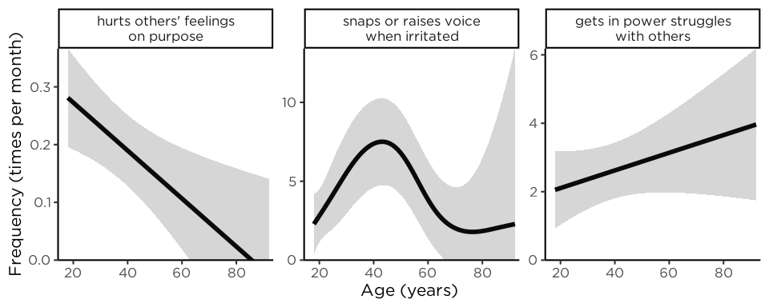
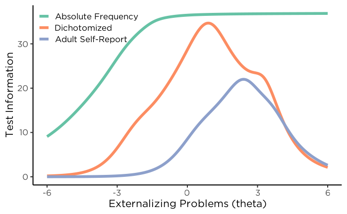
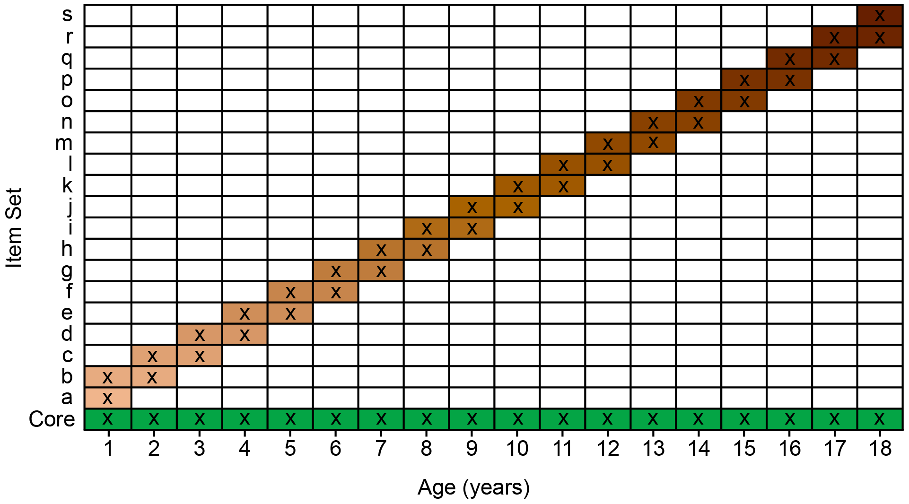
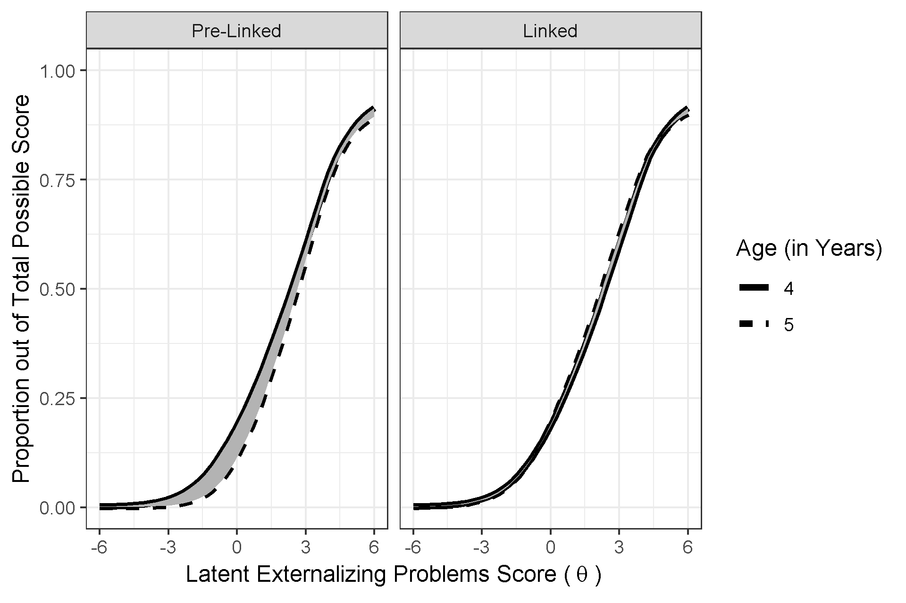
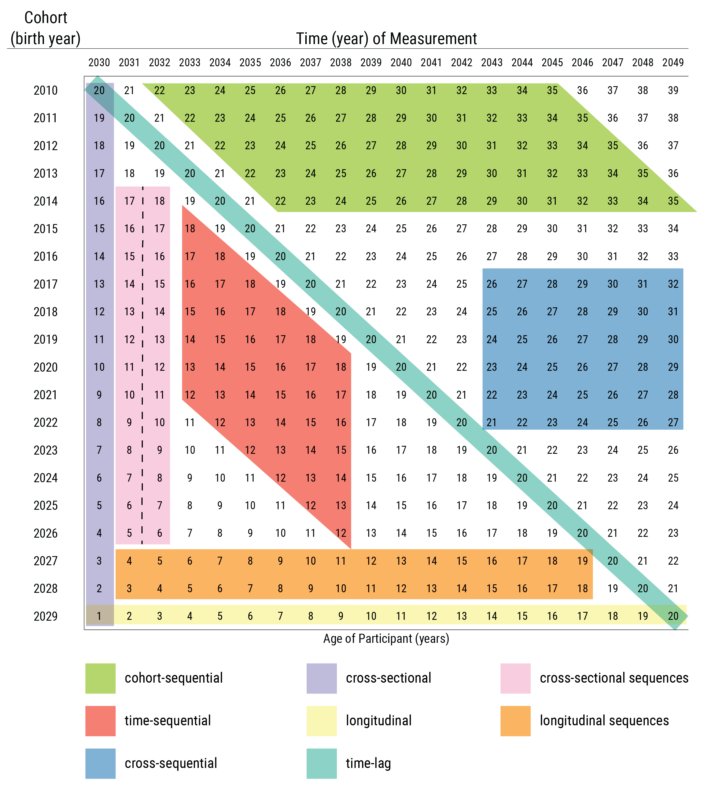

<!-- The introduction should not have a level-1 heading such as Introduction. -->

***NOTE: this manuscript is in progress of being drafted—it is incomplete.***

<!-- Placeholder for quote from upcoming "70 Up" -->

When entrenched, psychopathology is costly and difficult to treat [@Insel2008; @Wakschlag2019].
Understanding its developmental origins is therefore crucial for preventing later, more severe psychopathology.
Developmental science seeks to build a bridge that spans the lifespan—from infancy to older adulthood—and not just transitory periods in people's lives.
However, the field has not adequately studied individuals' development of psychopathology across the lifespan; instead, the field has taken a piecewise approach to development that focuses on narrower age ranges.
The focus on narrow age ranges restricts our ability to understand development across important transitions, such as puberty, school entry, and entry into parenthood, which in turn limits our understanding of lifespan development and the origins of psychopathology.
In this paper, we describe reasons why this is the case—beyond logistical challenges of time and money.
And we propose solutions to these challenges by introducing a developmental scaling framework for psychopathology.
Using externalizing psychopathology as an example, we draw on our content analysis of more than 270 externalizing measures, as well as lessons from the study of other constructs such as academic and cognitive skills across lengthy developmental periods.

# The Goal

A key goal of developmental science is to understand how people develop across the lifespan.
A variety of methods, including cross-sectional and longitudinal designs, could be leveraged for this purpose.
In a cross-sectional design, people are assessed at one timepoint.
In a longitudinal design, the same individuals are followed across time.

Cross-sectional designs provide the ability to relatively cheaply and quickly assess a wide age range, providing a snapshot at a particular point in time.
Cross-sectional designs may inform our understanding of general normative patterns of change—such as the typical pattern of cognitive growth and decline across the lifespan.
Thus, cross-sectional designs provide an important starting point.

However, cross-sectional designs have key limitations.
First, cross-sectional designs do not allow examining individuals' change over time.
Second, cross-sectional designs may obscure diverse patterns of change.
Individuals show considerable heterogeneity in level and change across time in many constructs.
As an example, despite the normative pattern of steep cognitive decline in episodic memory with aging, there are a subset of individuals who do not show this same pattern.
For instance, superagers are individuals who are older adults (age 80+) who have episodic memory at or above the normative level of middle-aged adults (50–65 years old) and who may be resilient to the typical aging process [@Godoy2021].
Theoretical depictions of the heterogeneity of cognitive decline are depicted in @fig-lifespancognitivetrajectories.

<!-- 
::: {#fig-lifespanCognitiveTrajectories layout="[[53,47]]" layout-valign="bottom"}
{
  #fig-lifespanCognitiveTrajectoriesSubgroups
  fig-alt="Hypothetical models for different cognitive trajectories of aging."
  }

{
  #fig-lifespanCognitiveTrajectoriesIndividuals
  fig-alt="Theoretical illustration of inter-individual variability in cognitive aging trajectories."
  }

**Panel A**: Hypothetical models for different cognitive trajectories of aging.
MCI = mild cognitive impairment.
(Figure in Panel B reprinted from @Borelli2018, Figure 1, p. 222. Borelli, W. V., Carmona, K. C., Studart-Neto, A., Nitrini, R., Caramelli, P., & Costa, J. C. d. (2018). Operationalized definition of older adults with high cognitive performance. *Dementia & Neuropsychologia*, *12*(3), 221–227. <https://doi.org/10.1590/1980-57642018dn12-030001>).
**Panel B**: Theoretical illustration of inter-individual variability in cognitive aging trajectories.
Each grey line represents one individual hypothetical cognitive health trajectory.
The orange line marks the threshold for functional independence; once an individual's cognitive health drops below this level, autonomous daily living is compromised.
(Figure in Panel B reprinted from @Abrous2026, Figure 1, p. 2. Abrous, D. N., Blin, N., Boraxbekk, C.-J., Catheline, G., Fitzsimons, C. P., Hilscher, M., Lemoine, M., Lopes, L. V., Maass, A., Nilsson, M., Nyberg, L., Rasmussen, L. J., Remondes, M., Sauvage, M., Schreiber, S., & Wolbers, T. (2026). Hallmarks of healthy cognitive aging: Inter-individual differences in aging trajectories. *Ageing Research Reviews*, *119*, 103102. <https://doi.org/10.1016/j.arr.2026.103102>)
:::
-->



::: {.figure-caption .content-visible when-format="html"}

**Panel A**: Hypothetical models for different cognitive trajectories of aging.
MCI = mild cognitive impairment.
(Figure in Panel B reprinted from @Borelli2018, Figure 1, p. 222. Borelli, W. V., Carmona, K. C., Studart-Neto, A., Nitrini, R., Caramelli, P., & Costa, J. C. d. (2018). Operationalized definition of older adults with high cognitive performance. *Dementia & Neuropsychologia*, *12*(3), 221–227. <https://doi.org/10.1590/1980-57642018dn12-030001>).

**Panel B**: Theoretical illustration of inter-individual variability in cognitive aging trajectories.
Each grey line represents one individual hypothetical cognitive health trajectory.
The orange line marks the threshold for functional independence; once an individual's cognitive health drops below this level, autonomous daily living is compromised.
(Figure in Panel B reprinted from @Abrous2026, Figure 1, p. 2. Abrous, D. N., Blin, N., Boraxbekk, C.-J., Catheline, G., Fitzsimons, C. P., Hilscher, M., Lemoine, M., Lopes, L. V., Maass, A., Nilsson, M., Nyberg, L., Rasmussen, L. J., Remondes, M., Sauvage, M., Schreiber, S., & Wolbers, T. (2026). Hallmarks of healthy cognitive aging: Inter-individual differences in aging trajectories. *Ageing Research Reviews*, *119*, 103102. <https://doi.org/10.1016/j.arr.2026.103102>)

:::

Heterogeneity also applies to psychopathology trajectories including externalizing and criminal behavior.
The age-crime curve depicts the well-known strong association between age and engagement in crime, with crime rates peaking markedly (in many Western countries) in adolescence around ages 15–19.
An example of the age-crime curve is depicted in @fig-externalizing-by-age.

However, Moffitt's [-@Moffitt1993] developmental taxonomy of externalizing ("antisocial") behavior posits that there are heterogeneous subgroups such that one subgroup exhibits low levels of externalizing behavior across the lifespan, an "adolescence limited" subgroup exhibits high levels of externalizing behavior during adolescence but low levels during childhood and adulthood, and a "life-course persistent" subgroup that exhibits high levels of externalizing behavior across the lifespan; in addition, more recent work has identified a "childhood limited" subgroup that exhibits high levels of externalizing behavior during childhood but low levels after childhood [@Fairchild2013; @Odgers2008].
The developmental taxonomy is depicted in @fig-externalizing-by-age.

Moffitt's general hypothesis is that life-course persistent externalizing behavior results from early disruptions in brain development either in utero (resulting from, for example, maternal substance use, poor prenatal nutrition, genetics, or exposure to toxins), during delivery (e.g., delivery complications), or after birth (e.g., child abuse or neglect, or exposure to toxins) that lead to impaired cognitive abilities and difficult temperament, in perhaps conjunction with coercive parent–child interactions or other adverse, criminogenic environments.
Adolescence-limited externalizing behavior, by contrast, is thought to reflect a more normative—even adaptive—pattern of social behavior that is driven by exposure to deviant peers and a maturity gap.
Childhood-limited externalizing behavior, though not hypothesized by the original taxonomy, may in some cases reflect recovery and in other cases reflect a shift from externalizing problems into problems in other domains [@Odgers2008].
It has been hypothesized that both childhood-limited and life-course persistent externalizing behavior may be characterized by high levels of individual-level risk (e.g., genetic and neuropsychological risk), whereas life-course persistent externalizing behavior may be characterized by greater environmental risk [e.g., adversity and trauma\; @Fairchild2013].
A cross-sectional study that does not capture the subgroups' different developmental histories would not be not well-positioned to adjudicate whether a particular individual is part of the adolescence-limited versus life-course persistent developmental course [@Moffitt1993].

The age-crime curve that is based on official police records has key problems [@Moffitt1993].
First, it misses the developmental course of externalizing behavior that leads up to the commission of crime.
Second, it is based on only those (criminal) behaviors that are known to official arrest records and does not capture other behaviors the person engaged in that are known to the individual or collateral report by caregivers, teachers, siblings, or peers.
Longitudinal work examining informant report of children's behavior allows estimating the prototypical trajectory of externalizing problems at ages younger than those encompassed by the age-crime curve, thus providing important developmental context to the origins of externalizing behavior.
For instance, in a longitudinal study examining the development of externalizing behavior from childhood to adulthood that incorporated ratings of the child's externalizing behavior from mothers, fathers, teachers, peers, and self-report (at relevant ages), @Petersen2015 found that externalizing problems normatively tended to decrease from early childhood to preadolescence, increased during adolescence (peaking around age 17), and decreased from late adolescence to adulthood.

Since @Moffitt1993 proposed the developmental taxonomy of externalizing behavior, work has examined individual differences in externalizing trajectories to determine whether they are best represented by categories—i.e., taxa such as adolescence-limited, life-course persistent, etc.—or dimensionally.
Findings have consistently shown that variation in externalizing trajectories is better represented dimensionally than with categories [@Fairchild2013; @Walters2011; @Walters2012; @Walters2013; @Walters2015], suggesting that differences between people in their developmental course of externalizing behavior appear to reflect differences in degree rather than kind (i.e., quantitative differences rather than qualitative differences).
For example, the trajectories in @Petersen2015 were characterized by marked individual differences; some individuals stayed low, some increased, some decreased, some increased then decreased, and seemingly everything in between.
The heterogeneous trajectories of externalizing problems are depicted in @fig-externalizing-by-age.

In sum, if we rely solely on normative age-related patterns of cognitive functioning or psychopathology from cross-sectional research, we would miss the immense differences in people's developmental courses.
And these individual differences are crucial to identify the risk and protective mechanisms that explain these differing developmental courses.

<!--
::: {#fig-externalizing-by-age layout="[[1], [1,1]]" layout-valign="bottom"}
{
  #fig-ageCrimeCurve
  fig-alt="The age-crime participation curve from age 9 through 64 in cohort members registered for antisocial and/or criminal behavior in a birth cohort recruited in Stockholm, Sweden (*N* = 4,825), based on official crime records."
  }

![A Stylized Depiction of Moffitt's [-@Moffitt1993] Developmental Taxonomy of Externalizing Behavior, Adapted to Include a Childhood Limited Subgroup.](Figures/developmentalTaxonomy.png){
  #fig-developmentalTaxonomy
  fig-alt="A stylized depiction of Moffitt's [-@Moffitt1993] developmental taxonomy of externalizing behavior, adapted to include a childhood limited subgroup."
  }

{
  #fig-extTrajectories
  fig-alt="Individuals' (*N* = 585) longitudinal trajectories of externalizing problems from childhood to adulthood based on annual assessments of mother-, father-, teacher-, peer-, and self-report (at relevant ages)."
  }

:::
-->



::: {.figure-caption .content-visible when-format="html"}

**Panel A**: The age-crime participation curve from age 9 through 64 in cohort members who were registered for antisocial and/or criminal behavior in a birth cohort recruited in Stockholm, Sweden (*N* = 4825), based on official records.
The steep peak in crime rate in the adolescent years is similar to the age-crime curve in the United States; however, the steepness of the age-crime curve differs within country across birth cohorts [@Steffensmeier2025].
(Figure adapted from @Sivertsson2024, Figure 1, p. 7. Sivertsson, F., Carlsson, C., Almquist, Y. B., & Brännström, L. (2024). Offending trajectories from childhood to retirement age: Findings from the Stockholm birth cohort study. *Journal of Criminal Justice*, *91*, 102155. <https://doi.org/10.1016/j.jcrimjus.2024.102155>).

**Panel B**: A stylized depiction of Moffitt's [-@Moffitt1993] developmental taxonomy of externalizing behavior, adapted to include a childhood limited subgroup.

**Panel C**: Individuals' (*N* = 585) longitudinal trajectories of externalizing problems from childhood to adulthood based on annual assessments of mother-, father-, teacher-, peer-, and self-report (at relevant ages).
Average trajectory in red.
(Figure adapted from @Petersen2015, Figure 2, Petersen, I. T., Bates, J. E., Dodge, K. A., Lansford, J. E., & Pettit, G. S. (2015). Describing and predicting developmental profiles of externalizing problems from childhood to adulthood. *Development and Psychopathology*, *27*(3), 791–818. <https://doi.org/10.1017/S0954579414000789>).

:::

Third, in a cross-sectional study, any apparent age-related differences in a construct could reflect cohort differences instead of developmental changes.
For example, average differences in stress between 5-year-olds and 10-year-olds could reflect the differing experiences that the 10-year-olds shared, such as going to school during the Coronavirus pandemic.
Fourth, findings from cross-sectional studies can differ from findings that are based on examining the same people over time—a violation of the convergence assumption.
In cross-sectional studies, the convergence assumption is the assumption that cross-sectional age differences and longitudinal age changes converge onto a common trajectory.
An example where the convergence assumption has been shown to be violated is in studies of cognitive decline.
In particular, cross-sectional studies overestimate age-related cognitive declines compared to following the same people over time in a longitudinal study, which may reflect cohort effects such as the Flynn effect [where population intelligence scores at a given age tend to increase across generations\; @Ackerman2013].

Because longitudinal designs follow the same person(s) over time, such a design allows examining individuals' change across time.
However, as we describe [later](#sec-potential-confounds-of-change), longitudinal designs also have potential confounds of change.
Moreover, compared to cross-sectional designs, longitudinal designs take more time and tend to be more costly and to require more personnel.
Thus, longitudinal studies that span the lifespan are not common.
However, even cross-sectional work spanning the lifespan is not often conducted.

# The Problem/Obstacle

The focal problem examined in this paper is that, despite calls to do so [@DeLosReyes2026], the field has not adequately studied individuals' development of psychopathology across the lifespan, instead taking a piecewise approach to development.
The piecewise approach to development limits our understanding of lifespan development and the origins of psychopathology.

A modest number of longitudinal studies have followed people over lengthy developmental periods.
We overview some of the seminal longitudinal studies that cover a lengthy span of development.
A depiction of the ages spanned by various longitudinal studies is in @fig-longitudinalstudies.



::: {.figure-caption .content-visible when-format="html"}

*Note*.
The list of longitudinal studies is as of this writing and is not exhaustive.
Studies that are no longer active are shown in gray.
Studies that used developmental scaling to harmonize scores across ages (i.e., to link scores across ages onto the same scale) are in green.
Solid lines reflect fully longitudinal spans (i.e., the same individuals were followed over time).
Dotted lines reflect ages assessed cross-sectionally—even if some participants may have been followed longitudinally.
For instance, if a study recruited 5–10-year-old children and followed each child for 20 years, the study would have dotted lines from ages 5–10 and from ages 25–30.
Studies shown entirely with dotted lines assessed their full age range cross-sectionally but still included longitudinal follow-up of some participants.
A star at age 0 represents that participants were enrolled before birth and the study included prenatal assessments.
Ages spanned reflect ages when assessments were collected directly from participants; ages spanned do not include links to registry data (e.g., birth records, offending records).
Age was truncated at 100; thus, age 100 indicates that participants were followed into their 90s (or until death).

:::

<!-- Describe findings (and limitations) from existing studies that have examined psychopathology or other constructs across the lifespan. -->

## Seminal Longitudinal Studies

### Fels Longitudinal Study

The Fels Longitudinal Study [@Roche1992] was a cohort-sequential study lasting from 1929 to 2018 that recruited 10–20 pregnant mothers each year from the Yellow Springs, Ohio area, and followed their newborns over time, eventually accruing 2,567 child participants and following them into older adulthood [e.g., age 82\; @Chumlea2012].
The study collected data on participants' body composition, including height and weight, which had key impacts and formed the basis of pediatric growth charts.
In addition, the study collected information on the participants' behavior—and other constructs—in childhood (based on observation) and adulthood (based on interview).
These rich data allowed researchers to examine the extent of personality continuity and change from childhood to adulthood, and the extent to which mothers may influence the personality development of the child [@Moss1964].
On the basis of predictive associations from childhood to adulthood in the Fels Longitudinal Study, @Kagan1962 noted that girls who had frequent tantrums at 6 to 10 years of age tended to become women who were more motivated in school, less dependent on others, and more masculine in their interests than women who had fewer tantrums as children.
They interpreted the different behaviors at different ages as stemming from the same psychological process: a tendency to avoid adopting "female sex-role standards" (p. 200).
Kagan described such findings, when psychological processes remain the same but the form of behavior changes, as examples of heterotypic continuity [@Kagan1969; @Kagan1971; @Kagan1980].

### Dunedin Multidisciplinary Health and Development Study

The Dunedin Multidisciplinary Health and Development Study is an ongoing birth cohort study that started in 1975 and recruited 1,037 3-year-old children in Dunedin, New Zealand [who were born in 1972–1973\; @Poulton2015].
It has followed participants to age 52 and includes data on a wide range of health and behavior constructs.
The study has yielded important insights including that children's self-control is more important than socioeconomic status or IQ in predicting their health, wealth, and crime in adulthood [@Moffitt2011], a general psychopathology factor (p factor) may account for the strong covariance among psychological disorders [@Caspi2014], that mental disorders have earlier developmental origins [@Poulton2015], a person's mental disorder tends to shift from one disorder to other disorders over the life course [@Caspi2020], and cross-sectional (i.e., retrospective) studies grossly underestimate lifetime prevalence of psychological disorders [compared to prospective longitudinal studies\; @Schaefer2017].

### Harvard Study of Adult Development

The Harvard Study of Adult Development, which consists of the Grant Study [@Vaillant2012] and the Glueck Study [@Glueck1950].
The Grant Study started in 1938 and recruited 268 White men from the Harvard classes of 1939–1944 at ages 18–19, and has followed them into their mid-90s.
The Glueck Study started in 1940 and recruited 456 11–16-year-old boys who were living in poor, high-crime inner-city neighborhoods in Boston, Massachusetts, and has followed them into their 80s.
One of the key findings from the Harvard Study of Adult Development, summarized in a Harvard Gazette article [@Mineo2017], is the importance of close relationships for healthy aging:
"Close relationships, more than money or fame, are what keep people happy throughout their lives, the study revealed.
Those ties protect people from life's discontents, help to delay mental and physical decline, and are better predictors of long and happy lives than social class, IQ, or even genes...people's level of satisfaction with their relationships at age 50 was a better predictor of physical health than their cholesterol levels were."

### Child Development Project

The Child Development Project [@Dodge1990] is a study that recruited 4-year-old children the year before kindergarten in 1987 and 1988 in Nashville, Tennessee, Knoxville, Tennessee, and Bloomington, Indiana.
Participants included 585 children, and they have been followed to age 34.
One of the key findings from the Child Development Project is that a hostile attribution bias, an aspect of social information processing that involves the tendency to interpret ambiguous social cues as hostile, predicts later aggression and that part of the association is mediated by peer rejection [@Lansford2010].

## Longitudinal Studies of Psychopathology

Longitudinal studies such as these have had immense impacts.
These studies have yielded many inferences that would not have been possible without longitudinal designs.
Some long-term longitudinal studies have even followed children of those children who were initially recruited, and are thus uniquely positioned to study questions of intergenerational transmission [e.g., @Kim2009].
However, relatively few longitudinal studies attempt to assess people's *change* in a given psychopathology construct over a long period.
Here, we focus on studies that have examined trajectories of externalizing behavior.[^trajectoriesFootnote]

[^trajectoriesFootnote]: We do not consider autoregressive/cross-lagged models because such models do not examine change in level of externalizing behavior.

A depiction of the ages spanned by various longitudinal studies is in @fig-longitudinal-externalizing-studies.
In the Child Development Project, @Petersen2015 examined trajectories of externalizing behavior from ages 5–27 with 20 measurement occasions.
In the Dunedin Multidisciplinary Health and Development Study, @Odgers2008 examined trajectories of antisocial conduct problems from ages 7–26 with 8 measurement occasions.
In the Mannheim Study of Children at Risk, @SacuInPress examined trajectories of externalizing behavior from ages 8–33 with 8 measurement occasions.
A study using six longitudinal datasets examined trajectories of disruptive behaviors and delinquency, with the longest trajectory spanning ages 6–15 with 7 measurement occasions [@Broidy2003].
In addition, a study examined trajectories of externalizing problems from ages 4–17 with 3 measurement occasions in predicting externalizing problems at age 27 [@Korhonen2018].
Other studies have examined trajectories of externalizing problems from ages 5–17 with 5 measurement occasions [@Bista2025], from ages 6–18 with 12 measurement occasions [@Shi2020], from ages 1.5–14.5 with 6 measurement occasions [@Kjeldsen2016], from ages 4–16 with 7 measurement occasions [Avon Longitudinal Study of Parents and Children (ALSPAC)\; @Speyer2022], from ages 3–17 with 6 measurement occasions [UK Millennium Cohort Study\; @Zhai2026], from ages 12–23 with 3 measurement occasions [@Stringer2020], from ages 2–15 with 11 measurement occasions [NICHD Study of Early Child Care and Youth Development [SECCYD]\; @Harris2025], and from ages 3–17 [@Gornik2023].
@Bongers2004 examined trajectories of various externalizing problems from ages 4–18 spanning 13 different birth cohorts with up to 5 measurement occasions per cohort, such that any individual was followed for up to 8 years [@Bongers2004].

Studies have also examined trajectories of delinquency from ages 7–19 with 13 measurement occasions [Pittsburgh Youth Study\; @Keijsers2012].
Demonstrating an analytic method (moderated nonlinear factor analysis) to link scores across measures onto the same scale, @ChenPM examined trajectories of delinquency from ages 12–26 with 3 measurement occasions in the National Longitudinal Study of Adolescent to Adult Health (Add Health), and @ChenMBR examined trajectories of externalizing behavior from ages 5–12 with 3 measurement occasions in the National Longitudinal Survey of Youth 1979 Child and Young Adult (NLSCYA).
Studies have also leveraged registry data to examine trajectories of offending from ages 8–61 [@LeBlanc2021], from ages 10–61 [Cambridge Study in Delinquent Development\; @Farrington2023], and from ages 9–64 [Stockholm Metropolitan Study\; @Sivertsson2024].



::: {.figure-caption .content-visible when-format="html"}

*Note*.
The list of longitudinal studies is not exhaustive. Studies that are based on registry data are shown in gray.
Measurement occasions are depicted with solid circles.
Note that, in some studies, measurement occasions only apply to a subset of participants in that study—in some cases, no participant was assessed at all measurement occasions.
Solid lines reflect fully longitudinal spans (i.e., the same individuals were followed over time).
Dotted lines reflect ages assessed cross-sectionally—even if some participants may have been followed longitudinally.
For instance, if a study recruited 5–10-year-old children and followed each child for 20 years, the study would have dotted lines from ages 5–10 and from ages 25–30.
Studies shown entirely with dotted lines assessed their full age range cross-sectionally but still included longitudinal follow-up of participants.
'MTSFGCLS' = Montreal Two Samples Four Generations Cross-sectional and Longitudinal Studies.

:::

However, as we will describe, these lengthy longitudinal studies of psychopathology [e.g., @Odgers2008]—including some of our own [e.g., @Petersen2015]—have important limitations in (a) how they assessed psychopathology constructs across development and (b) how they estimated people's scores on those constructs over time, which prevent strong inferences regarding individuals' change over time.

# Reasons for the Problem

Beyond logistical challenges of time and money, there are several key reasons why the field has failed to study people's development of psychopathology longitudinally across the lifespan.
First, diagnostic and taxonomic systems do not define psychopathology constructs from a developmental perspective.
A developmental perspective is crucial because psychopathology constructs often have earlier origins than their full clinical presentation, and forms of psychopathology frequently show changes in behavioral manifestation across development (heterotypic continuity).
Second, current assessments do not adequately capture these changes in behavioral manifestation.
Third, traditional scoring systems do not allow charting individuals' change over time in the face of changing behavioral manifestation.
Fourth, current assessments are not well-suited for capturing the full range of individual differences, despite the dimensional nature of psychopathology.
Fifth, as a result of these limitations, current assessments are not well-suited for capturing individuals' change over time.

Below, we describe these reasons in detail.
To ground the discussion, we provide examples relating to externalizing psychopathology; however, these issues are not specific to externalizing.

## Problems of Constructs

The first reason the field has failed to adequately study individuals' development of psychopathology across the lifespan represents a theory problem—namely, problems with constructs, and the codifying of those constructs in diagnostic and taxonomic systems.
In particular, our theories do not fully specify how constructs manifest behaviorally across the lifespan.
For instance, theories do not specify the features (e.g., cognitive, affective, or biological processes) or behaviors that characterize a given construct in each developmental period.
In addition, theories do not specify how those features or behaviors change across development with respect to how strongly they reflect the construct—as indicated by changes in factor loadings (in factor analysis) or discrimination (in item response theory)—or how they change in their level on the construct—as indicated by changes in intercepts (factor analysis) or difficulty/severity (item response theory).

These gaps are important for several reasons.
First, psychopathology does not come from nowhere; psychopathology constructs often have earlier origins than their full clinical presentation.
<!-- Give examples -->
In many cases, psychopathology may arise from the interaction of genetic and environmental factors, and their effects on biology, cognition, emotion, and behavior.
Such effects may accumulate and transpire over years.
Second, forms of psychopathology frequently show changes in behavioral manifestation across development—a phenomenon called heterotypic continuity [@Caspi2006; @Cicchetti2002; @Petersen2020; @Petersen2024].

Considerable theoretical work attempts to characterize constructs across development.
For instance, @Patterson1993 characterized externalizing ("antisocial") behavior as a chimera.
A chimera is a mythical creature with the body of a goat that, with development, grows the head of a lion and then a tail of a snake.
@Patterson1993 and @Moffitt1993 argued that externalizing behavior changes in manifestation across development such that underlying antisociality is maintained while more mature features are added across development.
In particular, Patterson [-@Patterson1993] noted that some externalizing behaviors wane with age, such as temper tantrums, whereas other externalizing behaviors emerge with age, including the ability to inflict serious damage or harm with violence, burglary, and shoplifting, in addition to problems such as academic failure, peer rejection, substance problems, and arrest.
Moffitt [-@Moffitt1993, p. 679] noted that externalizing behaviors may manifest as "biting and hitting at age 4, shoplifting and truancy at age 10, selling drugs and stealing cars at age 16, robbery and rape at age 22, and fraud and child abuse at age 30", and that the prognosis for individuals who engage in externalizing behavior throughout the life-course includes "drug and alcohol addiction; unsatisfactory employment; unpaid debts; homelessness; drunk driving; violent assault; multiple and unstable relationships; spouse battery; abandoned, neglected, or abused children; and psychiatric illness".

In general, externalizing behaviors are often expressed as overt acts in early childhood, such as physical aggression and temper tantrums; whereas externalizing behaviors are more often expressed later in development as covert and indirect or relational forms of aggression, rule breaking, and substance use [@Miller2009; @Petersen2026a].
These age-differing behaviors show strong stability of individual differences, indicating a consistent underlying construct [@Moffitt1993; @Patterson1993].
As depicted in @fig-absoluteFrequencyByAge, different externalizing behaviors are most common at different developmental periods—even into adulthood, consistent with the notion that externalizing behavior demonstrates heterotypic continuity.
Consistent with the Developmental Issues Framework [@Sroufe2016], the changing expression of externalizing behavior likely reflects a combination of time-varying genetic and environmental factors, such as school entry transition, in combination with varying developmental tasks, different opportunities, and greater experience-dependent capacity [@Petersen2020].

{
  #fig-absoluteFrequencyByAge
  width=100%
  fig-alt="Frequency (per Month) of Engaging in Various Externalizing Behaviors by Age (*N* = 1,237)."
  apa-note="Items are from the Externalizing Spectrum Inventory (ESI), but unlike the True/False ESI, participants rated items on an absolute frequency scale (times per day/week/month/year). The gray band is the 95% confidence interval. The figure demonstrates that different externalizing behaviors are most common at different developmental periods, consistent with heterotypic continuity. As examples, hurting others' feelings on purpose (left panel) was most common in early adulthood; snapping or raising one's voice (middle panel) was most common in middle adulthood; getting in power struggles with others (right panel) was most common in older adulthood. (Figure reprinted from @Petersen2026b, Figure 1, p. 301. Petersen, I. T., Demko, Z., Doebler, P., Sabel, L., Oleson, J. J., & Krueger, R. F. (2026). How often is \"often\"? Improving assessment of the externalizing spectrum using absolute frequency. *Psychological Assessment*, *38*(4), 295–306. <https://doi.org/10.1037/pas0001441>)."
  }

::: {.figure-caption .content-visible when-format="html"}

*Note*.
Items are from the Externalizing Spectrum Inventory (ESI), but unlike the True/False ESI, participants rated items on an absolute frequency scale (times per day/week/month/year).
The gray band is the 95% confidence interval.
The figure demonstrates that different externalizing behaviors are most common at different developmental periods, consistent with heterotypic continuity.
As examples, hurting others' feelings on purpose (left panel) was most common in early adulthood; snapping or raising one's voice (middle panel) was most common in middle adulthood; getting in power struggles with others (right panel) was most common in older adulthood.
(Figure reprinted from @Petersen2026b, Figure 1, p. 301. Petersen, I. T., Demko, Z., Doebler, P., Sabel, L., Oleson, J. J., & Krueger, R. F. (2026). How often is "often"? Improving assessment of the externalizing spectrum using absolute frequency. *Psychological Assessment*, *38*(4), 295–306. <https://doi.org/10.1037/pas0001441>)

:::

In addition to externalizing problems, both internalizing [@Petersen2018; @Tyrell2019; @Weems2008; @Weiss2003] and thought-disordered [@Rutter2006] problems are thought to change in manifestation across development.

However, more work is needed to developmentally parameterize constructs—to define constructs developmentally in terms of their features.
Recent empirical work suggests that it is uncommon for symptoms to change from one symptom to another for a given person at the subsequent measurement occasion [@Applegate2026].
Nevertheless, the authors found that adding new symptoms and subtracting symptoms—other ways that a construct can change in manifestation—were both relatively common.
Moreover, just because a symptom persists does not mean that the behavioral manifestation of that symptom stays the same for that individual.
For instance, even if a symptom (e.g., "fighting") persists for an individual, their manifestation of that symptom could differ in form, function, or mechanism [@Petersen2024].
Indeed, fighting is considered to differ in meaning from childhood to adulthood [@Patterson1993; @Tyrell2019].
Thus, as noted by @Applegate2026, "future causal theories will need to rest on a more detailed and nuanced description of persistence and change at the level of specific psychological problems."

Moreover, where such theories do indicate changes in behavioral manifestation across development, diagnostic and taxonomic systems do not incorporate these developmental changes.

### Lack of a Developmental Perspective

Diagnostic and taxonomic systems do not define psychopathology constructs from a developmental perspective.
The diagnostic systems, including the Diagnostic and Statistical Manual of Mental Disorders [DSM-5-TR\; @APA2022] and the International Classification of Diseases [ICD-11\; @WHO2022], specify various externalizing-related disorders, including attention-deficit/hyperactivity disorder (ADHD), oppositional defiant disorder (ODD), conduct disorder (CD), and antisocial personality disorder (ASPD).
Among externalizing-related disorders—with few exceptions[^dsmFootnote1]—the diagnostic criteria do not differ across development, even though diagnostic manuals acknowledge that developmental factors impact symptom presentation[^dsmFootnote2].
In addition to diagnostic systems, emerging taxonomies and frameworks of psychopathology—including the hierarchical taxonomy of psychopathology (HiTOP) and research domain criteria (RDoC)—do not incorporate a developmental perspective [@Tackett2022].

[^dsmFootnote1]: In the DSM-5-TR [@APA2022], the minimum frequency for considering a symptom of ODD to be present is "most days" (for a period of six months) for children younger than 5 years, whereas it is "at least once per week" (for at least six months) for children 5 years or older.
For the diagnosis of ADHD, six or more symptoms are required for children and younger adolescents (up to age 16), whereas five or more symptoms are required for older adolescents and adults (aged 17 or over).
However, the symptoms for defining ODD and ADHD do not differ across development.

[^dsmFootnote2]: In the DSM-5-TR [@APA2022], some disorders have a "Development and Course" subsection that describes when disorders tend to emerge and their rates across ages, in addition to describing the types of symptoms that may be more or less common at various points in development.
However, the symptoms that define the disorders do not differ across development.
For instance, in the section on major depressive disorder, it is noted that "hypersomnia and hyperphagia are more likely in younger individuals, and melancholic symptoms, particularly psychomotor disturbances, are more common in older individuals.
Depressions with earlier ages at onset are more familial and more likely to involve personality disturbances." (p. 189).
In the section on ADHD, it is noted that, "In preschool, the main manifestation is hyperactivity.
Inattention becomes more prominent during elementary school.
During adolescence, signs of hyperactivity (e.g., running and climbing) are less common and may be confined to fidgetiness or an inner feeling of jitteriness, restlessness, or impatience.
In adulthood, along with inattention and restlessness, impulsivity may remain problematic even when hyperactivity has diminished." (p. 71).
In the section on CD, it is noted that "Symptoms of the disorder vary with age as the individual develops increased physical
strength, cognitive abilities, and sexual maturity.
Symptom behaviors that emerge first tend to be less serious (e.g., lying, shoplifting), whereas conduct problems that emerge last tend to be more severe (e.g., rape, theft while confronting a victim)...
When individuals with conduct disorder reach adulthood, symptoms of aggression, property destruction, deceitfulness, and rule violation, including violence against co-workers, partners, and children, may be exhibited in the workplace and the home" (p. 534).
Moreover, some disorders in the DSM-5-TR note that, to be considered a symptom, the frequency, intensity, or persistence of the behavior must be inconsistent with the level expected for their developmental level.
For instance, in the diagnosis of ADHD, it is noted that "the symptoms have persisted for at least 6 months to a degree that is inconsistent with developmental level" (p. 68).
In the diagnosis of ODD, it is noted that "other factors [besides a minimum frequency] should also be considered, such as whether the frequency and intensity of the behaviors are outside a range that is normative for the individual's developmental level, gender, and culture." (p. 522).
In addition, some disorders require that some symptoms onset before or after a particular age.
For instance, in the diagnosis of ADHD, several symptoms must be present prior to age 12.
In the diagnosis of CD, the symptoms "often stays out at night despite parental prohibitions" and "if often truant from school" must begin before age 13 (p. 531).
In the diagnosis of ASPD, symptoms must be persistent since age 15 but have onset prior to age 15.

## Problems of Existing Assessments and Traditional Scoring Systems

Other key reasons the field has failed to adequately study individuals' development of psychopathology across the lifespan represent methodological problems—namely, problems with existing assessments and how those assessments are used, based on traditional scoring systems.
There is a mismatch between theory and method.
In particular, there is a mismatch between theory of constructs—including how a construct manifests behaviorally—and the methods used to assess the construct and to evaluate people's level and change in that construct.

### Do Not Adequately Capture Constructs' Change in Behavioral Manifestation Across Development

Given the substantial changes in behavioral manifestation of psychopathology across development, it is important for measures to capture the constructs' changing behavioral manifestation, to stay developmentally relevant and construct valid.
As noted by Moffitt [-@Moffitt1993, p. 694], "Measures of antisocial behavior should be sensitive to developmental heterogeneity to tap individual differences while allowing for the emergence of new forms of antisocial behavior (e.g., automobile theft) or for the forsaking of old forms (e.g., tantrums)."

However, measures show insufficient differences in which items are assessed at which ages to account for heterotypic continuity.
For example, among the most widely used measures of externalizing problems in research and practice is the Child Behavior Checklist (CBCL).
However, the same version of the Child Behavior Checklist (CBCL) spans ages 6–18.
Considerable development occurs during that span including key developmental transitions—from childhood to adolescence to emerging adulthood—and the CBCL does not capture such changes.

There are two primary ways that researchers have examined people's change in psychopathology across development (@fig-approachesToLongitudinalAssessment).
The "common items" approach removes items that are age specific.[^ageVsTimeFootnote]
For example, in a study of externalizing behavior from early childhood to adolescence, a study might remove some substance use items that are not be developmentally relevant at all ages.
The second approach, the "upward/downward extension" approach, takes items that are valid at a given age and uses those same items across all ages, even ages in which the item may not be valid or useful—i.e., all items are assessed at all ages.
For instance, the upward extension approach might take the item "disobedient to authority figures" and apply it to older individuals for whom such a behavior may no longer validly reflect externalizing behavior—and may instead reflect prosocial functions including protesting against societally unjust actions.
Both the "common items" [e.g., @Odgers2008; @Sterba2007] and "upward/downward extension" [e.g., @BriggsGowan2016; @Broeren2013] approaches are widely used, likely because they result in the same items assessed across ages, but both have key problems.

As an example of the common items approach, Odgers et al. [-@Odgers2008, p. 676] examined children's development of DSM-IV symptoms of conduct disorder from ages 7 to 26 years, but they dropped age-specific symptoms (e.g., running away, staying out late) "because [these symptoms] did not cover the study's age span".
As an example of the upward extension approach, Broeren et al. [-@Broeren2013, p. 84] examined children's development of anxiety from ages 4 to 11 years; they noted, "Although the questionnaire was originally developed to measure anxiety in preschoolers, the current study also employed the scale with older children to promote uniformity in measures".

[^ageVsTimeFootnote]: For simplicity and brevity, we refer to birth age as a proxy for developmental time.

{
  #fig-approachesToLongitudinalAssessment
  width=100%
  fig-alt="Approaches to Longitudinal Assessment."
  apa-note="Item set A refers to items that are construct-valid at only timepoint 1 (T1); item set B is construct-valid at both T1 and T2; item set C is construct-valid at only T2. A dash indicates that the item set was not assessed at a given timepoint. A white box indicates invalid assessment in terms of either a content gap (i.e., important missing items) or intrusion (i.e., invalid items at a given timepoint). In a study of externalizing behavior from early childhood to adulthood, \"biting others\" may be in item set A; \"noncompliant\" in B; \"drug use\" in C. The three approaches are: (1) common items: B at T1 and T2, (2) upward/downward extension: ABC at T1 and T2, or (3) construct-valid items: AB at T1; BC at T2. The \"common items\" and \"upward/downward extension\" approaches are by far the most widely used in the literature, even though they likely lead to inaccurate scores and thus inaccurate trajectories. (Figure reprinted from @Petersen2026a, Figure 1, p. 113. Petersen, I. T., Demko, Z., Lee, W.-C., & Oleson, J. J. (2026). Studying development of psychopathology using changing measures to account for heterotypic continuity. *JAACAP Open*, *4*(1), 111–123. <https://doi.org/10.1016/j.jaacop.2025.10.008>)."
  }

::: {.figure-caption .content-visible when-format="html"}

*Note*.
Item set A refers to items that are construct-valid at only timepoint 1 (T1); item set B is construct-valid at both T1 and T2; item set C is construct-valid at only T2.
A dash indicates that the item set was not assessed at a given timepoint.
A white box indicates invalid assessment in terms of either a content gap (i.e., important missing items) or intrusion (i.e., invalid items at a given timepoint).
In a study of externalizing behavior from early childhood to adulthood, "biting others" may be in item set A; "noncompliant" in B; "drug use" in C.
The three approaches are: (1) common items: B at T1 and T2, (2) upward/downward extension: ABC at T1 and T2, or (3) construct-valid items: AB at T1; BC at T2.
The "common items" and "upward/downward extension" approaches are by far the most widely used in the literature, even though they likely lead to inaccurate scores and thus inaccurate trajectories.
(Figure reprinted from @Petersen2026a, Figure 1, p. 113. Petersen, I. T., Demko, Z., Lee, W.-C., & Oleson, J. J. (2026). Studying development of psychopathology using changing measures to account for heterotypic continuity. *JAACAP Open*, *4*(1), 111–123. <https://doi.org/10.1016/j.jaacop.2025.10.008>)

:::

The common items approach yields low content validity because it does not assess all construct facets, especially age-specific manifestations.
The upward/downward extension approach violates construct validity because it assesses developmentally inappropriate items.

Due to these problems, both simulation [@Petersen2021a] and empirical work [@Chen2015; @Petersen2018; @Petersen2026a] have shown that the "common items" and "upward/downward extension" approaches lead to inaccurate developmental inferences.
In sum, despite these approaches being the most widely used for assessing individuals' development, they likely lead to inaccurate scores and thus inaccurate trajectories.

The problem cannot be solved merely by age-norming.
Generating norms from items that are invalid at a given age or from scales that have important content gaps at a given age leads to construct-invalid scores and resulting norms.
Moreover, age-norming prevents observing absolute growth and is problematic in longitudinal studies [@Moeller2015].
Likewise, using DSM disorders or diagnoses also does not solve the problem.
<!-- Using DSM disorders/diagnoses does not solve the issue. Fictitious categories. Diagnostic criteria change, leading prior categorizations to fall out of favor. -->

In addition, forcing use of the same measure across time naturally limits the ages a study can span, which prevents charting wider age spans.
For example, if a researcher used the CBCL and only wanted to study trajectories where the same measure was assessed across ages, they would not be able to examine development from ages 5–6, when there is a change in the CBCL version (i.e., one for ages 1.5–5 and another for ages 6–18).
<!-- USE EXT EXAMPLE -->
<!-- For example, one could not examine development of depression across ages 11 to 13 years using the Short Mood and Feelings Questionnaire due to changes in its functioning (in particular, some items were less relevant at age 11) that likely reflect developmental changes in manifestation of depression.20  -->

In addition to the behavioral expression of a construct changing across developmental time, the behavioral expression of a construct can also change across historical time.
Changes in the behavioral manifestation across historical time can lead existing items and measures to become obsolete and for new items to become relevant.
For instance, many measures and longitudinal studies do not assess important contemporary manifestations of externalizing behavior, including aggression on social media and cyberbullying [@Nickerson2026].
Changes in the behavioral manifestation across historical time provide additional reasons to change the measure by removing no-longer-valid items and by adding newer valid items.

In sum, many problems arise from using the same measure across ages when the construct changes in behavioral manifestation across development and historical time.

### Do Not Allow Charting Individuals' Change Over Time When the Construct Changes in Behavioral Manifestation

Current assessments fail to implement the construct-valid item approach across development—existing measures show insufficient differences in which items are assessed at which ages.
Moreover, even in cases where the items of a measure differ across ages (e.g., CBCL: ages 1.5–5 vs. ages 6–18), the scoring systems do not link scores across ages to be on the same scale while preserving change in level.
For instance, when using age-differing measures of externalizing behavior to account for changes in behavioral manifestation across development, Kjeldsen et al. [-@Kjeldsen2016, p. 999] noted in their study, "Due to change in measures and rescaled variables, only relative change across classes can be interpreted and not absolute (developmental) change."
Thus, the measures do not yield scores that are comparable across time and that enable change in an individual's level to be observed across a lengthy developmental span.
In some cases, mean scores and proportion of maximum scores have been used to account for the age-differing measures having different numbers of items [@Owens2003; @Petersen2015; @SacuInPress].
However, such approaches assume that the age-differing measures have the same overall functioning in terms of difficulty and discrimination (described later), which is unlikely.
Age norms and standardized scores (*T*- or *z*-scores) do not allow observing individuals' absolute change because scores have a fixed mean and variance, and they do not equal developmental understanding.
<!-- Studies examining trajectories of T/z-scores -->
Absolute change is necessary to identify true growth for an individual, and is thus important for treatment monitoring and longitudinal growth curves.
Moreover, it is important for scores across ages to be on the same apples-to-apples scale so the scores can be compared across ages, which would be valuable even in a cross-sectional study that spans a wide age range, as might be found in an epidemiological study.

There is a misperception that no practical approach exists that can handle different measures across ages or time.
Consider the following statement by LeBlanc [-@LeBlanc2021, p. 15], "The theoretical position is that a form of antisocial behavior, for example, fraud, has to be measured by distinct behaviors with adolescents and adults, in summary adapted to their age.
Nevertheless, different scale composition is an integral part of the common concept of fraud.
To our knowledge there is no recognized analytical procedure to assess such a construct and the life cycle validity of heteromorphous measures."

However, considerable research in educational psychology links scores across age-differing measures to be on the same scale.
For instance, standardized tests are frequently administered in schools to determine the extent of growth across grades.
Because of large changes in ability level across grades, the same math and reading items cannot be administered at all grades.
Otherwise, respondents would receive items that are too easy (thus evoking boredom) or too difficult (thus evoking frustration), relative to their ability.
To address this, the test developers write the tests so that some items are in common across adjacent grades—used for linking the scores across grades onto the same scale—along with items that are unique to a particular grade.
Then, the researchers apply widely used methods to link the scores from the different measures onto the same scale so they can observe individuals' growth across grades.
The same general methods are also used to place people's scores on the same scale for standardized tests like the ACT, SAT, GRE, MCAT, LSAT, etc., despite repondents receiving different item content.

For examples of studies applying various linking methods to academic and cognitive skills, see @McArdle2009, @McArdle2011, @Murayama2013, @Oleson2016, @Petscher2018, @Ward2022, and @Weeks2018.
However, the use of linking methods is rare in studies of social and behavioral development broadly and psychopathology specifically.
For studies that have applied such methods in studying social and behavioral development, see studies on self-concept [@Hancock2008], neuroticism [@Lai2023], self-regulation [@Hosch2022], underactivity/overactivity [and their subdimensions\; @McDermott2013], thought-disordered problems [@Petersen2026a], internalizing problems [@Harris2025; @Petersen2018; @Petersen2026a; @Tyrell2019], and externalizing problems [@ChenMBR; @ChenPM; @Harris2025; @Petersen2021b; @Petersen2022; @Petersen2026a].

In addition, psychopathology assessments do not include such scoring tools.
The lack of scoring tools that link scores from age-differing psychopathology assessments leads researchers to restrict the age range of study.
For instance, in their study, Bista et al. [-@Bista2025, p. 179] noted "A different version of the questionnaire (CBCL/2–3), designed for 2–3-year-olds, was used for the year 2 follow-up [compared to the CBCL/4–18 assessed from ages 5–17].
Therefore, we excluded age 2 from our trajectory analysis."

### Not Well-Suited For Capturing the Full Range of Individual Differences

Many measures use coarse, subjective response scales such as Likert-type response scales (e.g., "rarely", "sometimes", "often", "very often") leading to cultural bias [@Schaeffer1991; @Schwarz1999; @Paalman2013] and insensitivity to change.
Items with few discrete response categories tend to show less sensitivity to the full range of individual differences [@Elliott1980] and less sensitivity to change [i.e., responsiveness\; @Grant1999] compared to items with more response options that have greater variability in scores.
In general, items with more response options yield more information [i.e., greater reduction of uncertainty in estimates of a person's construct level; though there are diminishing returns when using more than six response options\; @Culpepper2013; @Simms2019].
Indeed, as depicted in @fig-absoluteFrequencyInformation, items assessing absolute frequency have been shown to yield more information than dichotomized versions of the same items and than the Achenbach Adult Self-Report, which uses Likert-type response options.
In addition, if a respondent implicitly uses the target's same-aged peers as the normative reference group for determining the relative frequency of a behavior, this could have the implicit effect of resulting in age-normed scores, which works against the goal of detecting change.
Moreover, Likert-type scales tend to focus on frequency of misbehavior and ignore intensity and severity.
It can be helpful to explicitly assess—and distinguish—frequency versus problematic impact of behavior.
Instead of assessing relative frequency, researchers advise assessing absolute frequency of behavior [@Burns2001; @Schwarz1999]—in addition to other aspects of behavior including onset, timing, duration, intensity, function, and resulting impairment.

{
  #fig-absoluteFrequencyInformation
  width=100%
  fig-alt="Test Information Functions of Absolute Frequency Versus Dichotomized Versus Adult Self-Report Items: Test Information as a Function of Theta (θ)."
  apa-note="\"Absolute Frequency\" refers to count items; \"Dichotomized\" refers to dichotomized versions of the count items; \"Adult Self-Report\" refers to items from the Achenbach Adult Self-Report. Theta represents the person's level on the latent externalizing problems factor. The figure demonstrates that items assessing absolute frequency yield more information (i.e., measurement precision) than dichotomized versions of the same items and the Likert-type response options of the Adult Self-Report. (Figure reprinted from @Petersen2026b, Figure 4, p. 303. Petersen, I. T., Demko, Z., Doebler, P., Sabel, L., Oleson, J. J., & Krueger, R. F. (2026). How often is \"often\"? Improving assessment of the externalizing spectrum using absolute frequency. *Psychological Assessment*, *38*(4), 295–306. <https://doi.org/10.1037/pas0001441>)."
  }

::: {.figure-caption .content-visible when-format="html"}

*Note*.
"Absolute Frequency" refers to count items; "Dichotomized" refers to dichotomized versions of the count items; "Adult Self-Report" refers to items from the Achenbach Adult Self-Report.
"θ" represents the person's level on the latent externalizing problems factor.
The figure demonstrates that items assessing absolute frequency yield more information than dichotomized versions of the same items and the Likert-type response options of the Adult Self-Report.
(Figure reprinted from @Petersen2026b, Figure 4, p. 303. Petersen, I. T., Demko, Z., Doebler, P., Sabel, L., Oleson, J. J., & Krueger, R. F. (2026). How often is "often"? Improving assessment of the externalizing spectrum using absolute frequency. *Psychological Assessment*, *38*(4), 295–306. <https://doi.org/10.1037/pas0001441>)

:::

In addition, the measures focus on extreme or clinical-range behaviors; scores are thus positively skewed with floor effects and have unacceptably low reliability [including the CBCL\; @Kaat2019; @Pavlovich2026; @Tiego2023], making the CBCL and existing measures unsuitable for dimensional research [@Pavlovich2026; @Tiego2023].
Considerable evidence indicates that externalizing problems [and psychopathology, more generally\; @Haslam2012; @Haslam2020; @Kotov2017; @Krueger2002; @Krueger2011; @Krueger2016; @Markon2011; @Wright2013] and their trajectories [@Burt2012; @Fairchild2013; @Walters2011; @Walters2012; @Walters2013; @Walters2015] and risk factors [@Walters2014] are best conceptualized dimensionally [or multi-dimensionally\; @Bolhuis2017; @Wakschlag2014], not categorically [@Barry2013; @Coghill2012; @Forbes2016; @Kliem2018; @Kliem2022; @Krueger2004; @Krueger2005; @Krueger2007; @Krueger2021; @Markon2005; @Sellbom2016; @Walton2011].
Thus, the existing measures are impoverished for studying the full range of individual differences on the externalizing spectrum, which prevents subthreshold children who are at risk for impairment from being identified.
Better identification of subthreshold externalizing is critical, in both research and practice, for identifying at-risk individuals in the early-stage trajectory of psychopathology.
As noted by Pavlovich et al. [-@Pavlovich2026, p. 1], "These findings...highlight the need for measures explicitly developed and validated for dimensional psychopathology in population-scale research.".

To provide better phenotypic resolution, and to better identify biological processes underlying psychopathology, @Tiego2023 argue for including content covering the full range, including items assessing the adaptive end of the continuum.
Doing so would help move the field away from a focus of symptoms (and absence of symptoms) and toward consideration of the full range of functioning, including thriving.
As they note, low scores on clinical measures are typically intended to assess absence of pathological functioning rather than the opposite end of the latent continuum—i.e., the presence of adaptive functioning.
For instance, it can be valuable to consider "positive opposites"—i.e., positive behaviors that compete with and are (simultaneously) incompatible with the particular antisocial behavior.
For instance, in a study of externalizing behavior, it would be valuable to consider prosocial behavior (e.g., kindness, helping others, sharing, dependability, compliance, accountability).
Indeed, in a machine learning study of children's conduct problems in the ABCD study, prosocial behavior was the strongest predictor [@Berluti2026].
Moreover, measures of externalizing behavior tend to focus on just global scores or just one or a few subdimensions.
For better phenotypic resolution, instruments should assess a wide range of phenotypes to better capture the full range of externalizing behaviors, which will be important to distinguish various forms of behavior—e.g., physical versus verbal versus destructive versus relational aggression—and their functions—e.g., proactive versus reactive.

Based on our content analysis of over 270 measures of externalizing behavior, we identified a wide range of facets that would be important for measures of externalizing behavior to capture (see @tbl-externalizingfacets).
We also identified potential positive opposites of each facet.



Because existing measures do not capture the full range of individual differences, this naturally further limits the measures' sensitivity to detect change (i.e., responsiveness), which is crucial for clinical utility and for longitudinal research.
Moreover, it is important for measures not to show restriction of range owing to ceiling or floor effects.

### Not Well-Suited for Capturing Individuals' Change Over Time

In sum, although they have been helpful, existing measures are poorly suited to classify individuals' development of psychopathology across a lengthy span, which is necessary for tracking individuals' change and identifying mechanisms in the development of psychopathology.
As we described above, existing assessments of externalizing behavior—and of other forms of psychopathology—have key limitations.
To address this concern, the field will need to develop better assessments.
Moreover, there are problems with how assessments are used to examine development—studies have primarily used the common items approach or the upward/downward extension approach across ages, which are problematic approaches that lead to inaccurate scores and resulting trajectories and developmental inferences.
To address this concern, we propose a potential solution to account for heterotypic continuity and to allow charting individuals' change across the lifespan: a developmental scaling framework.

# Solution: A Developmental Scaling Framework

A developmental scaling framework informs both assessment—including item selection—and linking of scores.

## Item Selection

When a construct changes in behavioral manifestation across development, which we would argue is the norm rather than the exception when considering constructs across the lifespan, it is essential to account for such changes in item selection.
Thus, it is important to use the construct-valid items at a given age, even if that leads to using different measures across ages.
A conceptual depiction of an example construct-valid item design spanning infancy to adulthood is in @fig-constructValidItemDesign.
In the construct-valid item design, some items represent the core of the phenotype and are assessed across all ages, whereas other items are age-specific.
Despite some age-specific items, some age-common items are assessed at adjacent ages, which help serve as anchor items for linking the scores across the adjacent ages.
The use of overlapping yet distinct items is widely used in educational testing to help link individuals' scores across grades, and is called vertical scaling because the item sets appear to form a line moving upward (see @fig-constructValidItemDesign).
For example, for a standardized test of math ability, kindergartners may receive items assessing counting, 1st graders may receive items assessing counting and addition, 2nd graders may receive items assessing addition and subtraction, and so on.

{
  #fig-constructValidItemDesign
  width=100%
  fig-alt="Conceptual depiction of a construct-valid item design from infancy to adulthood."
  apa-note="The age(s) at which an item set is assessed are represented by the letter `x` and a colored box. Some items (\"Core\", in green) represent the core of the phenotype and are assessed across all ages. Some items (in varying shades of brown) are age-specific and are assessed at only one or a few ages. However, some of the items assessed at a given age are shared with those assessed at adjacent ages, to facilitate linking the scores across ages. For instance, item set `f` can be used to help link scores from age 6 to those at age 5, and item set `g` can be used to help link scores from age 6 to those at age 7. Hypothetically, items could be assessed for as many or as few years as desired—as long as the items are construct valid for those ages and there enough age-common items between adjacent ages for linking scores across ages."
  }

::: {.figure-caption .content-visible when-format="html"}

*Note*.
The age(s) at which an item set is assessed are represented by the letter `x` and a colored box.
Some items ("Core", in green) represent the core of the phenotype and are assessed across all ages.
Some items (in varying shades of brown) are age-specific and are assessed at only one or a few ages.
However, some of the items assessed at a given age are shared with those assessed at adjacent ages, to facilitate linking the scores across ages.
For instance, item set `f` can be used to help link scores from age 6 to those at age 5, and item set `g` can be used to help link scores from age 6 to those at age 7.
Hypothetically, items could be assessed for as many or as few years as desired—as long as the items are construct valid for those ages and there enough age-common items between adjacent ages for linking scores across ages.

:::

## Linking of Scores

After the age-differing measures have been assessed, the scores from the age-differing measures can be linked to be on the same scale.
To perform developmental scaling, a variety of approaches can be used, including partial measurement invariance, the alignment method, moderated nonlinear factor analysis (MNLFA), and item response theory (IRT).
These are all approaches to harmonization—i.e., linking scores from different measures onto the same scale so they can be meaningfully compared.
Harmonization is also used for integrative data analysis, to pool data from different measures in various studies [@Curran2008; @McDaniel2023].
The aforementioned approaches to harmonization attempt to estimate latent variables—using either confirmatory factor analysis (CFA) or IRT—on a common scale across ages.
<!-- DESCRIBE COMMONALITIES/SIMILARITIES AMONG THE APPROACHES -->
They do so by trying to align the item parameters for at least a subset of items.
In particular, to be able to chart individuals' change over time, it is helpful to ensure that the scores are on the same number line across time—that is, they have the same scale and location across ages.
Scale refers to the size of a unit on the number line.
If scores have the same scale across ages, a one-unit difference represents the same amount of the construct at each age.
Location refers to the origin or zero point on the number line.
If scores have the same location across ages, a score of zero corresponds to the same position on the construct across ages.
Collectively, if scores have the same scale and location across ages, the measure is constantly calibrated across ages and the same score corresponds to the same level on the construct across ages.
CFA and IRT each have item parameters corresponding to scale and location.

In CFA, scale is informed by an item's factor loading, and location is informed by an item's intercept.
A factor loading reflects the strength of association between the item and the latent factor, with larger loadings indicating stronger associations.
For instance, an item assessing the extent to which a child hits others would have a stronger factor loading on an externalizing factor than an item assessing the extent to which a child likes ice cream.
The intercept is the expected score on the item when the latent factor equals zero.
When the latent factor is centered to have a mean of zero, the intercept represents the expected score on the item for someone at the mean level of the construct.
Items with lower intercepts tend to be endorsed by individuals with higher levels of the latent factor and therefore often reflect more severe behaviors.
For example, an item assessing the extent to which a child sets fires would be expected to have a lower intercept than an item assessing the extent to which a child argues.

In IRT, scale is informed by an item's discrimination, and location is informed by an item's difficulty.
An item's discrimination reflects how strongly the item differentiates individuals at different levels of the construct, with higher discrimination indicating a stronger association with the latent factor.
In a two-parameter IRT model, an item's difficulty reflects the level on the latent factor where there is a 50% probability of endorsing the item.
Items with higher difficulty require a higher level of the latent factor to have a 50% probability of endorsing the item and therefore represent more severe behaviors.

### Partial Invariance

The partial invariance method can be used to link scores across different measures [@Tyrell2019] and can be paired with second-order growth functions to examine individuals' change over time [@Hancock2008].
The partial invariance approach attempts to establish partial strong longitudinal factorial invariance[^strongInvarianceFootnote]—i.e., invariant intercepts and factor loadings across ages for a subset of items to set the latent factor across ages on a comparable scale, with some items' intercepts and/or factor loadings allowed to differ across ages.
The researcher first identifies which items show invariant factor loadings and/or intercepts and which items show noninvariant factor loadings or intercepts.
The researcher then constrains the factor loadings across time for any items with invariant factor loadings, to serve as anchor items and establish an equivalent scale of the measures across time, and allows the factor loadings to differ across time for the items with noninvariant factor loadings.
In addition, the researcher constrains the intercepts across time for any items with invariant intercepts, to serve as anchor items and establish an equivalent location of the measures across time, and allows the intercepts to differ across time for the items with noninvariant intercepts.
The anchor items thus equate the latent factor over time, preventing drift in the scale calibration and rendering scores comparable across time [@ChenPM].
Then, the researcher estimates second-order growth functions (e.g., intercept and slope) of the first-order latent factor across time.
The method can allow different indicators across ages, either by dropping or adding indicators or by using item parcels composed of differing items across ages [@Tyrell2019].

However, the partial invariance approach requires identifying—and accurately specifying—invariant items and any noninvariant items, which can be both inefficient and error-prone [@Lai2023; @ChenPM].
Moreover, the partial invariance approach tends not to work as well when a large proportion of items are noninvariant [@Lai2023], there are many timepoints, there is considerable variability in the numbers of responses provided to items such as might occur due to missing data or when not all items are assessed at all timepoints, or the researcher wants to consider DIF as a function of multiple variables or continuous variables [@ChenPM].

[^strongInvarianceFootnote]: Strong invariance is also called "scalar invariance".

### Alignment Optimization

The alignment optimization method [@Muthen2014] has been used to link scores across time [@Lai2023].
The alignment optimization method within confirmatory factor analysis attempts to identify a model with approximate longitudinal factorial invariance—that is, to retain any instances of large noninvariance across ages and to keep other parameters approximately invariant across ages—to adjust for violations of invariance.
The approach uses a component loss function to align the item parameters across ages so that the scores on the latent factors are on the same scale.
Unlike the partial invariance method, the alignment method does not require a priori identification of any noninvariant items [@Lai2023].

### Moderated Nonlinear Factor Analysis

MNLFA [@Bauer2017] has also been used to link scores across different measures [@Curran2014], including across ages [@ChenPM; @ChenMBR; @Student2025].
Unlike the partial invariance approach, MNLFA represents the measurement model in continuous time (rather than discrete time).
MNLFA allows simultaneous estimation of growth functions while estimating and accounting for DIF effects.
It allows estimating DIF as a function of time and as a function of multiple variables, including categorical and continuous variables.
Bayesian approaches can be used to apply MNLFA.
A key benefit of Bayesian approaches is the use of regularizing priors that allow estimating the model without having to identify noninvariant/DIF items and anchor items in advance [@ChenPM; @ChenMBR].
Using regularization, unimportant DIF effects are shunken toward zero—while retaining larger DIF effects—thus identifying potential anchor items without having to specify them in advance [@ChenPM].
In addition, Bayesian approaches are often better suited to handle small sample sizes and data with sparse responses [@ChenPM].
Using a simulation, @ChenMBR found that MNLFA estimated change more accurately than traditional first- or second-order growth curve models.

### Item Response Theory

IRT can also be used to link scores across different measures [@Kolen2014].
The IRT approach to developmental scaling is depicted in @fig-linking.
<!-- CONCURRENT VS SEPARATE CALIBRATION -->
The IRT approach to developmental scaling identifies scaling parameters that minimize the differences in the probability of a person endorsing the age-common items across two measures, at a given construct level.
That is, IRT links measures' scales based on the difficulty and discrimination of the age-common items.
In developmental scaling, scores on the construct-valid items at the reference age set the scale; the age-common items adjusts subsequent scores to that scale, and all construct-valid items (i.e., both age-common and age-unique items) at a given timepoint is used to estimate each person's score on that scale.
Thus, the age-common items are used to determine the general form of change on an identical scale, but all developmentally relevant, construct-valid items are used to estimate each person's construct level on this scale.
Traditionally IRT represents the measurement model in discrete time.
Like MNFLA, however, IRT (particularly in the mixed model formulation) can represent the measurement model in continuous time and allows testing DIF over time and as a function of multiple variables and continuous variables.
Moreover, like MNLFA, it allows simultaneous estimation of growth functions while estimating and accounting for DIF effects. 
In addition, like MNFLA, IRT allows Bayesian estimation and regularizing priors to identify anchor items without having to specify them in advance.

{
  #fig-linking
  width=100%
  fig-alt="Example of linking scores from measures across ages using the item response theory approach to developmental scaling."
  apa-note="The figure illustrates the effect of linking the latent externalizing problems scores, θ, across ages, using developmental scaling. The left panel illustrates the test characteristic curves representing the model-implied proportion out of total possible scores across the latent externalizing problems score at age 4 and 5, before the linking process. The right panel illustrates the test characteristic curves after the linking process. The shading between the age 4 and age 5 test characteristic curves represents differences between the two test characteristic curves in terms of discrimination and/or severity, where larger differences reflect scores that are less comparable. Linking minimizes differences between the discrimination and severity of the age-common items. Discrimination is depicted by the steepness of the slope at the inflection point of the test characteristic curve. Severity is represented by the value on the x-axis at the inflection point of the test characteristic curve. The left panel indicates that the externalizing problem items showed higher severity (i.e., its inflection point is further right) and somewhat stronger discrimination (i.e., its slope is steeper) at age 5 than at age 4. The right panel shows considerably smaller differences between the two test characteristic curves, which provides empirical evidence that the linking successfully placed the latent externalizing problem scores across age on a more comparable scale (i.e., more similar discrimination and severity of the age-common items). (Figure reprinted from @Petersen2021b, Figure 1, p. 74. Petersen, I. T., & LeBeau, B. (2021). Language ability in the development of externalizing behavior problems in childhood. *Journal of Educational Psychology*, *113*(1), 68–85. <https://doi.org/10.1037/edu0000461>)."
  }

::: {.figure-caption .content-visible when-format="html"}

*Note*.
The figure illustrates the effect of linking the latent externalizing problems scores, θ, across ages, using developmental scaling.
The left panel illustrates the test characteristic curves representing the model-implied proportion out of total possible scores across the latent externalizing problems score at age 4 and 5, before the linking process.
The right panel illustrates the test characteristic curves after the linking process.
The shading between the age 4 and age 5 test characteristic curves represents differences between the two test characteristic curves in terms of discrimination and/or severity, where larger differences reflect scores that are less comparable.
Linking minimizes differences between the discrimination and severity of the age-common items.
Discrimination is depicted by the steepness of the slope at the inflection point of the test characteristic curve.
Severity is represented by the value on the x-axis at the inflection point of the test characteristic curve.
The left panel indicates that the externalizing problem items showed higher severity (i.e., its inflection point is further right) and somewhat stronger discrimination (i.e., its slope is steeper) at age 5 than at age 4.
The right panel shows considerably smaller differences between the two test characteristic curves, which provides empirical evidence that the linking successfully placed the latent externalizing problem scores across age on a more comparable scale (i.e., more similar discrimination and severity of the age-common items).
(Figure reprinted from @Petersen2021b, Figure 1, p. 74. Petersen, I. T., & LeBeau, B. (2021). Language ability in the development of externalizing behavior problems in childhood. *Journal of Educational Psychology*, *113*(1), 68–85. <https://doi.org/10.1037/edu0000461>)

:::

Nevertheless, for many of these approaches, at least one anchor item is necessary to link the scale of the latent factor across timepoints [@ChenPM].
Moreover, when treating time continuously, the functional form of any DIF as a function of time must be correctly specified [@ChenPM].

# Other Key Challenges to Address

In addition to linking scores across time to be on the same scale, to study the development of psychopathology across the lifespan, there are additional key challenges to address, including considering and/or addressing potential confounds of change, factorial invariance, integration across multiple sources, and obsolescence of items.

## Potential Confounds of Change {#sec-potential-confounds-of-change}

It is important for longitudinal research to consider and, to the extent possible, account for potential confounds of change, such as practice effects, period and cohort effects, measurement error, selective attrition, and changes in the meaning of the scores [@Hertzog2003].
By confound of change, we mean that such effects can make it appear that people have changed in their level on the construct when, in reality, they have not changed (or vice versa).

### Practice/Retest Effects

Practice effects (also called retest effects) occur to the extent that a person's score changes due to repeated assessment rather than due to changes in their construct level.
For instance, if researchers intend to study people's intelligence across development and they use the same measure and stimuli at each measurement occasion, it is possible that people may perform better over time because they are learning the task and thus improving their score—even if their intelligence has not changed.
In a longitudinal study of externalizing problems using repeated surveys, retest effects might be most likely to be detected in the form of decreases for a person across ages, which may reflect fatigue in reporting [@Averdijk2014].
Lower ratings for an individual across time may be especially likely if the surveys include branching logic such that the respondent learns that additional items appear whenever they endorse an item (and that those additional items would not have appeared had they not endorsed the item).
Ways to reduce retest effects include changing the measure and/or stimuli [@Tyrell2019] and increasing the retest interval.
Thus, an added benefit of accounting for heterotypic continuity (by changing the measure across development to align with changes in the construct manifestation) is the reduction of retest effects.
A way to account for retest effects is through the use of accelerated longitudinal (i.e., cross-sequential) designs that can separately estimate the effects of age versus timepoint because, unlike in a single-cohort longitudinal design, age and timepoint are decoupled [@Ferrer2004].

### Period and Cohort Effects

Researchers are commonly interested in how people develop as a function of age.
Age refers to a person's chronological age at the time of measurement.
Age is a proxy for development—a stand-in for the myriad ways in which one's biology and social roles—and one's corresponding employment, income, and family structure—change as people age [@Rohrer2025].
However, apparent age-related differences in a cross-sectional or longitudinal study could reflect period or cohort effects instead of development.
Thus, it is important to consider and, to the extent possible, account for period and cohort effects.

Period refers to the historical time at which measurement occurs.
If people are assessed during a given time period (e.g., during a war, recession, pandemic, or stressor), their scores could be influenced by the historical time period.
The extent to which scores are attributable to the time period (e.g., the economic situation or prevailing standard of living) in which they are assessed is called a period effect.

Cohort refers to a group of people who experience similar events or historical contexts at similar ages.
Cohort commonly refers to birth cohort, which represents the group of people who were born around the same time.
If a group of people were born around the same time (e.g., in 1940), their scores may differ from those of people born in other eras because they experienced different historical, social, educational, economic, or technological contexts during development.
The extent to which scores are attributable to an individual's birth cohort is called a cohort effect—that is, "the (enduring, constant) effects of having been a certain age at a certain point in historic time." [@Rohrer2025, p. 2].
Period and cohort—like age—are proxy variables for other, causal processes.

Part of the challenge of estimating the unique contributions of age, period, and cohort is that they are deterministically related.
If you know two of these (e.g., age and period), you can determine the third (e.g., cohort).
That is, $\text{age} = \text{period} - \text{cohort}$.

Various types of cross-sectional and longitudinal designs are depicted in @fig-longitudinalDesigns.
In a cross-sectional study, any age-related differences are confounded with cohort differences.
Thus, age-related differences in a cross-sectional study may not reflect development.
In a single-cohort longitudinal design, any observed changes with age could be due to period effects (rather than developmental change associated with aging) or could be specific to that cohort.
To combat these limitations, studies may employ longitudinal sequential designs that incorporate multiple cohorts, such as time-sequential, cross-sequential, or cohort-sequential designs.
For instance, a cross-sequential study (also called accelerated longitudinal study) starts as a cross-sectional study with participants from multiple cohorts, and then follows the participants longitudinally.
In a cohort-sequential design, multiple cohorts enter the study at the same age (e.g., age 22) and are then followed longitudinally (typically across the same duration and ages), like starting a longitudinal study at the same age over and over again.
A time-sequential design is an extension of a time-lag design.
A time-lag design assesses multiple cohorts at the same age (e.g., age 12).
A time-sequential design adds age groups to a time-lag design, repeatedly assessing the same age range (e.g., ages 12–18), with some participants followed longitudinally.

{
  #fig-longitudinalDesigns
  width=100%
  fig-alt="Research Designs by Time Of Measurement and Cohort"
  apa-note="Values in the cells are ages of the participants. Dashed line indicates different participants were assessed at each time of measurement. (Figure reprinted from @PetersenPrinciplesPsychAssessment, Petersen, I. T. (2026). *Principles of psychological assessment: With applied examples in R*. University of Iowa Libraries. <https://doi.org/10.25820/work.007199>). Although the depictions of cohort-sequential and cross-sequential designs differ from the depictions by @Schaie2005 (i.e., they are reversed), they are consistent with contemporary definitions of these designs [@Little2024; @Masche2004; @Whitbourne2019]."
  }

::: {.figure-caption .content-visible when-format="html"}

*Note*.
Values in the cells are ages of the participants.
Dashed line indicates different participants were assessed at each time of measurement.
(Figure reprinted from @PetersenPrinciplesPsychAssessment, Petersen, I. T. (2026). *Principles of psychological assessment: With applied examples in R*. University of Iowa Libraries. <https://doi.org/10.25820/work.007199>).
Although the depictions of cohort-sequential and cross-sequential designs differ from the depictions by @Schaie2005 (i.e., they are reversed), they are consistent with contemporary definitions of these designs [@Little2024; @Masche2004; @Whitbourne2019].

:::

Longitudinal sequential designs provide greater leverage for distinguishing age, period, and cohort influences by collecting information from multiple cohorts at multiple periods and ages.
Nevertheless, they do not completely eliminate the confounding between age, period, and cohort [@Rohrer2025].
No research design can fully disentangle age, period, and cohort effects.
Confidence that observed age-related differences reflect developmental change increases when there is converging evidence across multiple research designs.
However, in a given study, there may be ways to account for period or cohort effects.
For instance, in an accelerated longitudinal study, it would be valuable to evaluate the extent to which the differing cohorts are comparable—i.e., that they show similar scores at the same ages.
Moreover, there is an entire set of analytic approaches, known as age-period-cohort analysis [@Yang2013], whose goal is to disentangle the effects of age, period, and cohort.
@Rohrer2025 provides additional suggestions for considering age, period, and cohort effects.

### Measurement Error

Measurement error is another potential confound of change that can make it look like change has occurred when, in reality, change has not occurred.
Consider the difference between scores at two measurement occasions, a so called "difference score," which is a common way of examining change.
Difference scores are notoriously unreliable.
Difference scores tend to be lower in reliability than each of the indices that comprise it, especially when the two indexes are correlated because differences depend on the reliability of both indices in the subtraction [@Revelle2019].
To be reliable, difference scores require high reliability of the individual indices compared to the correlation between them.
That is, the more two things are the same thing, the more likely that subtracting one from the other leaves measurement error rather than construct variance.
Ways of accounting for (random) measurement error include (a) combining multiple measures in estimation of a latent variable and (b) using growth curve models with at least three timepoints to estimate model-implied trajectories and reduce the influence of occasion-specific random error.

In general, the inference of change is strengthened to the extent that: (a) the magnitude of the difference between the scores at the time points is large (i.e., a large effect size), (b) the measurement error (unreliability) at each time point is small, (c) the measure has the same meaning and is on a comparable scale at each time point, and (d) evidence suggests that the differences across time are not likely to be due to potential confounds of change such as practice effects, cohort effects, period effects, or selective attrition.

### Selective Missingness and Attrition

Another potential confound of change is selective (or systematic) missingness or attrition.
If people who drop out of a longitudinal study differ in systematic ways from those who are retained, inferences about growth patterns and about associations with growth parameters can be biased.
Consider an intervention study with two groups: a treatment group that received a medication and a control group that received a placebo.
The control group showed a 30% reduction in externalizing problems, on average.
In the treatment group, some individuals showed a reduction in externalizing problems whereas others dropped out of the study due to side effects or worsening behavior.
If we analyzed only those who were followed until the end of the study, it might appear that the treatment was effective merely because we were excluding individuals for whom the treatment was harmful.
Thus, it is important to report the extent of missingness, whether missingness is systematically related to demographic and study variables, and to leverage modern approaches for handling missing data so that one does not exclude participants in the analysis merely because they have missing data [@Nicholson2017].
Multiple imputation and full information maximum likelihood are useful if data are missing at random or completely at random [@Nicholson2017].
Enders [-@Enders2022; -@Enders2025] provides contemporary guidelines for handling missing data, including when data are missing not at random using selection models and pattern mixture models—including in longitudinal studies [@Enders2022].
@Nicholson2017 provides recommendations for reporting about attrition and missingness in longitudinal studies.

### Change in Meaning of the Scores

Another potential confound of change is if the same score has different meaning (with respect to the construct) at different points in development.
That is, the scores are not on the same number line across time—they do not have the same scale or location across ages.
If scores do not have the same scale or location across ages, any inferences about change (or lack thereof) could be incorrect.
Consider, for example, if a behavior such as physical aggression becomes more severe (i.e., higher difficulty) with age.
In this example, the same score—i.e., endorsement of physical aggression—would reflect a higher level externalizing behavior in adulthood compared to early childhood.
Or, consider if a behavior such as disobedience becomes less construct-valid (i.e., lower discrimination) with age.
In this example, the same score difference—i.e., between endorsement (1) versus non-endorsement (0) of disobedience to authority—would reflect a greater difference in the level of externalizing behavior in early childhood compared to adulthood.
Thus, it is important to consider and account for changes in the meaning of scores across development.
If a measure changes in the construct it assesses, this is called construct shift.
Next, we describe longitudinal factorial invariance as a way to evaluate—and account for—the possibility that scores have changed in meaning across ages.

## Factorial Invariance Across Time

Traditionally, it had been considered necessary to establish factorial invariance[^invarianceFootnote] of the measure(s) across time—that is, the measure(s) assess the construct in the same way across time—to study individuals' change in those constructs [@Widaman2010].
As described earlier, a goal of longitudinal factorial invariance is to increase confidence that the latent factor at multiple timepoints is on the same scale so that meaningful changes in people's level can be observed. 
In particular, it had been considered necessary to establish at least strong factorial invariance—i.e., invariance of intercepts and factor loadings in factor analysis, or invariance of difficulty and discrimination in item response theory.
Otherwise, a researcher may wrongly conclude that levels in the construct change over time when the apparent changes in the observed scores (and the latent variables) are driven by noninvariant loadings and/or intercepts for one or more items [@Lai2023].
However, it is now understood that violations of longitudinal factorial invariance do not mean that questions of change cannot be answered [@Lai2023].
Strong factorial invariance frequently does not hold, so in such situations, it may be necessary to find ways to accommodate or adjust for noninvariance [@Lai2023].

At least partial strong factorial invariance (i.e., invariance of intercepts and factor loadings for a subset of items—the anchor items) is often considered a requirement for modeling individuals' change, such that the more items that show invariance, the greater the confidence that the latent factor is on a comparable scale at each age for examining individuals' change.
However, even that requirement may be too strong.
Researchers have argued that, in many cases, establishing factorial invariance may be unnecessary to compare latent means [@DeLosReyes2025; @Funder2024; @Knight2010; @Petersen2020; @QuantitudeS3E18; @Robitzsch2023; @Welzel2023a; @Welzel2023b].
Indeed, failed longitudinal invariance can be an artifact of differing means across groups/time rather than bias or differences in the functioning of the measure [@Welzel2023a; @Welzel2023b].
As noted by Hancock [-@QuantitudeS3E18], to model differences in latent means (e.g., change over time), you do not need invariance; "you need to have a model that is correct...That means that...you are modeling [items'] invariance properly."

When a construct demonstrates heterotypic continuity, longitudinal factorial invariance would not necessarily be expected because the construct's factor structure, by definition, changes with development [@Petersen2020].
That is, noninvariances across development can be expected by theory [@Sterner2026].
As a result, theoretical considerations are crucial and establishing even partial longitudinal factorial invariance may not be required when the construct shows heterotypic continuity [@Knight2010; @Petersen2020].
As noted by Millsap [-@Millsap2011, p. 1], "Measurement invariance is built on the notion that a measuring device should function in the same way across varied conditions, *so long as those varied conditions are irrelevant to the attribute being measured*" (emphasis added).
However, age/development would not be considered irrelevant to psychopathology.
As described earlier, externalizing (antisocial) behavior is considered to demonstrate heterotypic continuity; therefore, longitudinal factorial *noninvariance* for measures assessing the development of externalizing behavior may be expected.

As noted by De Los Reyes et al. [-@DeLosReyes2025, p. 301], "developmental variations in antisocial behavior are unlikely to reflect confounds or biases in measurement."
De Los Reyes and colleagues characterize such tests of invariance across development—in which the conditions (age) are relevant to the construct of interest—as a questionable research practice, noting, "To be justified in testing measurement invariance [across ages], one would have to assume that when systematic differences manifest between ratings...for younger versus older youth, they cannot possibly reflect anything valid.
For a scholar to make such an assumption, they must again ignore decades of theory and research in developmental psychopathology."
Moreover, removing noninvariant items is not recommended if the item retains construct validity [@Knight2010; @DeLosReyes2025].
When the construct changes in manifestation, models with failed longitudinal factorial invariance can yield valid inferences.
For instance, simulation work demonstrated that IRT linking approaches accurately captured changes in level on the latent factor even in the present of DIF and changing dimensionality [@Edwards2012].

There are multiple ways of handling noninvariance as described above, including alignment optimization, MNLFA, and IRT-based linking.
In addition, another approach is to allow approximate factorial invariance.
Approximate measurement invariance allows invariance parameters to have a small amount of noninvariance rather than fixing invariance parameters to zero [@VanDeSchoot2013].
Approximate measurement invariance is more accurate than full or partial measurement invariance for estimating true latent mean differences when there are many small differences in the intercepts and factor loadings [@Cieciuch2014; @VanDeSchoot2013].
Approximate measurement invariance has also been applied in the longitudinal context [e.g., @Seddig2018; @Winter2020].
Robitzsch and Lüdtke [-@Robitzsch2023, p. 859] argue that establishing factorial invariance is neither necessary nor sufficient for comparing latent means, and they note that "there is no support for preferring the partial invariance approach over competing approaches, such as invariance alignment, robust linking, or Bayesian approximate invariance."

[^invarianceFootnote]: Factorial invariance is also called measurement invariance.
In this context, we prefer the term "factorial invariance" because, as described, the actual measures used may differ across time.

## Integration Across Multiple Sources

The most accurate informant(s) for a person can change with development, so it may be necessary to include different informants across time.
There is widespread agreement that including multiple sources of data—e.g.. multiple informants or multiple measurement methods—is preferable.
However, there is less agreement about how to use the multiple sources of data [@Bauer2013], particularly because informants often show low correspondence with one another when rating the same person.
Some of these discrepancies may be confounded by the person behaving differently in different contexts or with different people.
The inclusion of multiple measurement methods can help account for measurement error given the considerable variance that is attributable to method bias [@Podsakoff2012].
The inclusion of multiple informants can be relevant for informing about the pervasiveness of a person's behavior across contexts (e.g., home, school).

As a result of including multiple or different informants across development, it is important to consider how to leverage the multi-informant ratings.
Some researchers advocate for integrating scores using principal component approaches [while disentangling variance attributable to trait, perspective, and context\; @Kraemer2003] or latent variable approaches [e.g., @Bauer2013], and others advocate for keeping different informants' ratings separate without integrating them [but including them in the same model\; @Aitken2023].
As an example of a latent variable modeling approach, @Bauer2013 demonstrates a trifactor model that attempts to disentangle construct variance from the method effects tied to the specific item and the informant.
@DeLosReyes2013 provide the Operations Triad Model as a framework for using and interpreting reports from multiple informants [for more information, see @Makol2025].
In sum, finding ways to leverage the information from multiple informants will be crucial for studying the development of psychopathology across the lifespan [@DeLosReyes2026].

## Obsolescence of Items and Measures

Another challenge is that questionnaire items—whether the particular wording or the behavior itself—can become obsolete and irrelevant with secular changes.
For instance, due to technological changes, items focused on television use—without considering other forms of screen use—may miss important contemporary screen-related use.
Additionally, ways people use substances change over historical time.
For instance, vaping is a more contemporary way that many adolescents use nicotine.
The ways in which aggressive behavior manifests also changes across historical time.
Items focused on physical aggression would miss important contemporary manifestations of aggression, including cyberaggression, cyberbullying, online harassment, and aggression on social media (e.g., exclusion).
In sum, it is important to keep items relevant for current use, and that naturally means changing item content and/or wording across historical time, a further reason why linking of scores (given differing item content) is crucial.

# Conclusion

Due to a variety of challenges—both conceptual and methodological—that we discuss, the field has not adequately studied individuals' development of psychopathology across the lifespan, instead taking a piecewise approach to development that limits our understanding of lifespan development and the origins of psychopathology.
To address these challenges, we discuss the importance of defining psychopathology constructs from a developmental perspective, developing new assessments that (a) capture changes in behavioral manifestation of psychopathology, (b) apply scoring systems that allow charting individuals' change over time in the face of changing behavioral manifestation, and (c) capture the full range of individual differences.
We introduce a developmental scaling framework to help address these challenges.
Addressing these challenges will allow charting individuals' trajectories of psychopathology across the lifespan and identifying risk and protective factors that influence their developmental courses.
Doing so is critical for understanding how psychopathology develops, when to intervene, and how to most effectively prevent psychopathology.
Although this paper focuses on development of psychopathology, the principles discussed likely apply to many other developmental domains.

# References

<!-- References will auto-populate in the refs div below -->

::: {#refs}
:::
