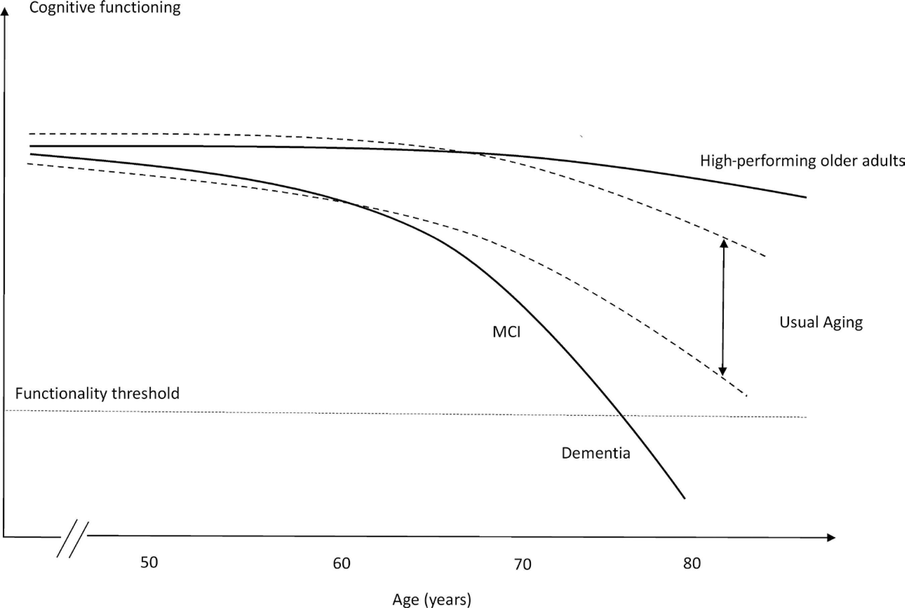
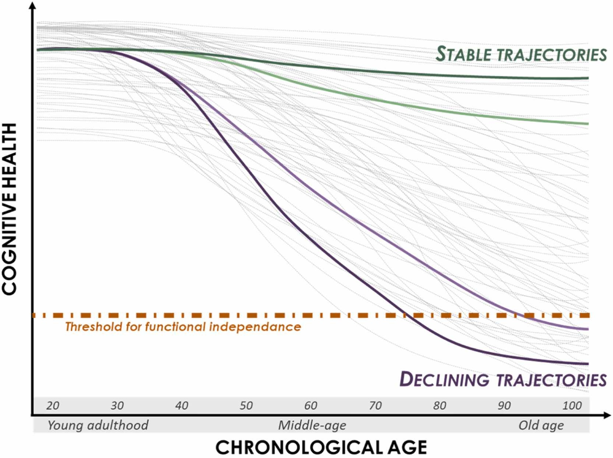
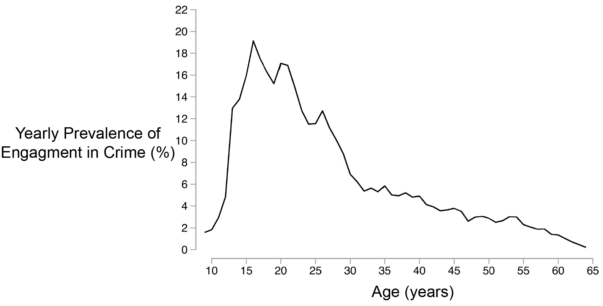
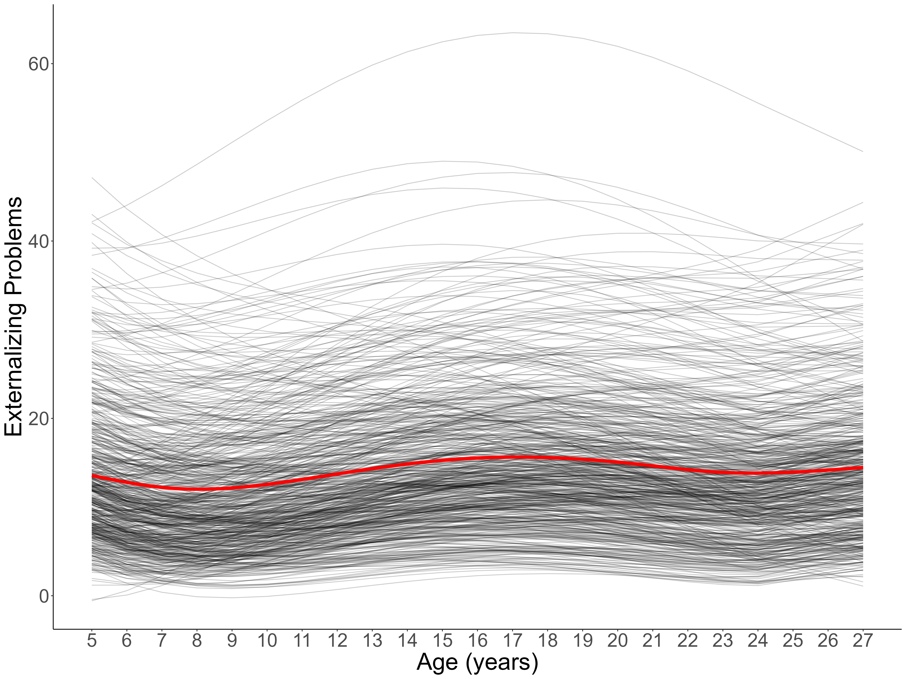
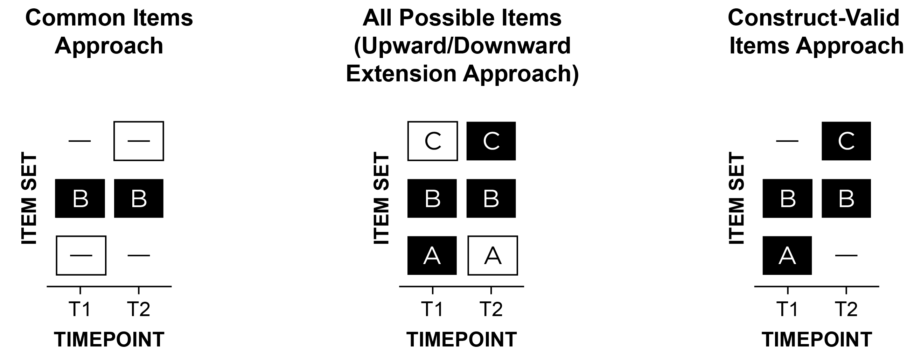

<!-- The introduction should not have a level-1 heading such as Introduction. -->

***NOTE: this manuscript is in progress of being drafted—it is incomplete.***

When entrenched, psychopathology is costly and difficult to treat [@Insel2008; @Wakschlag2019].
Understanding its developmental origins is therefore crucial for preventing later, more severe psychopathology.
Developmental science seeks to build a bridge that spans the lifespan—from infancy to older adulthood—and not just transitory periods in people's lives.
However, the field has not adequately studied individuals' development of psychopathology across the lifespan, instead taking a piecewise approach to development that focuses on narrower age ranges.
The focus on narrow age ranges restricts our ability to understand development across important transitions, such as puberty, school entry, and entry into parenthood, thus limiting our understanding of lifespan development and the origins of psychopathology.
In this paper, we describe reasons why this is the case—beyond logistical challenges of time and money.
And we propose solutions to these challenges by introducing a developmental scaling framework for psychopathology.
Using externalizing psychopathology as an example, we draw on our content analysis of over 270 externalizing measures, as well as lessons from the study of other constructs such as academic and cognitive skills across lengthy developmental periods.

# The Goal

A key goal of developmental science is to understand how people develop across the lifespan.
A variety of methods, including cross-sectional and longitudinal designs, could be leveraged for this purpose.
In a cross-sectional design, people are assessed at one timepoint.
In a longitudinal design, the same individuals are followed across time.

Cross-sectional designs provide the ability to cheaply and quickly assess a wide age range, providing a snapshot at a particular point in time.
Cross-sectional designs may inform our understanding of general normative patterns of change—such as the typical pattern of cognitive growth and decline across the lifespan.
Thus, cross-sectional designs provide an important starting point.

However, cross-sectional designs have key limitations.
First, cross-sectional designs do not allow examining individuals' change over time.
Second, cross-sectional designs may obscure diverse patterns of change.
Individuals show considerable heterogeneity in level and change across time in many constructs.
As an example, despite the normative pattern of steep cognitive decline in episodic memory with age, there are a subset of individuals who do not show this same pattern.
For instance, superagers are individuals who are older adults (age 80+) who have episodic memory at or above the normative level of middle-aged adults (50–65 years old) and who may be resilient to the typical aging process [@Godoy2021].
Theoretical depictions of the heterogeneity of cognitive decline are depicted in @fig-lifespanCognitiveTrajectories.

::: {#fig-lifespanCognitiveTrajectories layout="[[53,47]]"}
{#fig-lifespanCognitiveTrajectoriesSubgroups fig-alt="Hypothetical models for different cognitive trajectories of aging."}

{#fig-lifespanCognitiveTrajectoriesIndividuals fig-alt="Theoretical illustration of inter-individual variability in cognitive aging trajectories."}

**Panel A**: Hypothetical models for different cognitive trajectories of aging.
MCI = mild cognitive impairment.
(Figure in Panel B reprinted from @Borelli2018, Figure 1, p. 222. Borelli, W. V., Carmona, K. C., Studart-Neto, A., Nitrini, R., Caramelli, P., & Costa, J. C. d. (2018). Operationalized definition of older adults with high cognitive performance. *Dementia & Neuropsychologia*, *12*(3), 221–227. <https://doi.org/10.1590/1980-57642018dn12-030001>).
**Panel B**: Theoretical illustration of inter-individual variability in cognitive aging trajectories.
Each grey line represents one individual hypothetical cognitive health trajectory.
The orange line marks the threshold for functional independence; once an individual's cognitive health drops below this level, autonomous daily living is compromised.
(Figure in Panel B reprinted from @Abrous2026, Figure 1, p. 2. Abrous, D. N., Blin, N., Boraxbekk, C.-J., Catheline, G., Fitzsimons, C. P., Hilscher, M., Lemoine, M., Lopes, L. V., Maass, A., Nilsson, M., Nyberg, L., Rasmussen, L. J., Remondes, M., Sauvage, M., Schreiber, S., & Wolbers, T. (2026). Hallmarks of healthy cognitive aging: Inter-individual differences in aging trajectories. *Ageing Research Reviews*, *119*, 103102. <https://doi.org/10.1016/j.arr.2026.103102>)
:::

Heterogeneity also applies to psychopathology trajectories including externalizing and criminal behavior.
The age-crime curve depicts the well-known strong association between age and engagement in crime, with crime rates peaking markedly (in many Western countries) in adolescence around ages 15–19.
An example of the age-crime curve is depicted in @fig-externalizingByAge.

However, Moffitt's [-@Moffitt1993] developmental taxonomy of externalizing behavior posits that there are heterogeneous subgroups such that one subgroup exhibits low levels of externalizing behavior across the lifespan, an "adolescence limited" subgroup exhibits high levels of externalizing behavior during adolescence but low levels during childhood and adulthood, and a "life-course persistent" subgroup that exhibits high levels of externalizing behavior across the lifespan; in addition, more recent work has identified a "childhood limited" subgroup that exhibits high levels of externalizing behavior during childhood but low levels after childhood [@Fairchild2013; @Odgers2008].
The developmental taxonomy is depicted in @fig-developmentalTaxonomy.
Moffitt's general hypothesis is that life-course persistent externalizing behavior results from early disruptions in brain development either in utero (resulting from, for example, maternal substance use, poor prenatal nutrition, genetics, or exposure to toxins), during delivery (e.g., delivery complications), or after birth (e.g., child abuse or neglect, or exposure to toxins) that lead to impaired cognitive abilities and difficult temperament, in perhaps conjunction with coercive parent–child interactions or other adverse, criminogenic environments.
<!-- Adolescence-limited externalizing behavior, by contrast, is thought to reflect a more normative—even adaptive—pattern of social behavior that is driven by exposure to deviant peers. -->
<!-- Childhood-limited externalizing behavior -->
A cross-sectional study that does not capture the subgroups' different developmental histories would not be not well-positioned to adjudicate whether a particular individual is part of the adolescence-limited versus life-course persistent developmental course [@Moffitt1993].

<!-- figure of developmental taxonomy -->
<!-- Describe hypothesized causes of different trajectory patterns.  -->

The age-crime curve that is based on official police records has key problems [@Moffitt1993].
First, it misses the developmental course of externalizing behavior that leads up to the commission of crime.
Second, it is based on only those (criminal) behaviors that are known to official arrest records and does not capture other behaviors the person engaged in that are known to the individual or collateral report by caregivers, teachers, siblings, or peers.
In a longitudinal study examining the development of externalizing behavior from childhood to adulthood that incorporated ratings of the child's externalizing behavior from mothers, fathers, teachers, peers, and self-report (at relevant ages), @Petersen2015 found that externalizing problems normatively tended to decrease from early childhood to preadolescence, increased during adolescence (peaking around age 17), and decreased from late adolescence to adulthood.
<!-- However, trajectories represent dimensional differences etc. -->
However, the trajectories were characterized by marked individual differences—some individuals stayed low, some increased, some decreased, some increased then decreased, and seemingly everything in between. <!-- add figure -->
<!-- Figure from Petersen et al. (2015) -->

In sum, if we rely solely on normative age-related patterns of cognitive functioning or psychopathology from cross-sectional research, we would miss the great individual differences in people's developmental courses.
And these individual differences are crucial to identify the risk and protective mechanisms that explain these differing developmental courses.
<!-- Note that the approaches that researchers have largely used to study development (including Petersen et al., 2015 and others) have problems; i.e., they have *attempted* to study development -->

::: {#fig-externalizingByAge layout-ncol=2}
{#fig-ageCrimeCurve fig-alt="The age-crime participation curve from age 9 through 64 in cohort members registered for antisocial and/or criminal behavior in a birth cohort recruited in Stockholm, Sweden (*N* = 4825), based on official crime records."}

![Moffitt's [-@Moffitt1993] developmental taxonomy of externalizing behavior, adapted to include a childhood limited subgroup.](Figures/developmentalTaxonomy.png){#fig-developmentalTaxonomy fig-alt="Moffitt's [-@Moffitt1993] developmental taxonomy of externalizing behavior, adapted to include a childhood limited subgroup."}

<!-- {#fig-extTrajectories fig-alt="Individuals' (*N* = 585) longitudinal trajectories of externalizing problems from annual assessments using mothers, fathers, teachers, peers, and self-report (at relevant ages)."} -->

**Panel A**: The age-crime participation curve from age 9 through 64 in cohort members registered for antisocial and/or criminal behavior in a birth cohort recruited in Stockholm, Sweden (*N* = 4825), based on official records.
The steep peak in crime rate in the adolescent years is similar to the age-crime curve in the United States; however, the steepness of the age-crime curve differs within country across birth cohorts [@Steffensmeier2025].
(Figure adapted from @Sivertsson2024, Figure 1, p. 7. Sivertsson, F., Carlsson, C., Almquist, Y. B., & Brännström, L. (2024). Offending trajectories from childhood to retirement age: Findings from the Stockholm birth cohort study. *Journal of Criminal Justice*, *91*, 102155. <https://doi.org/10.1016/j.jcrimjus.2024.102155>).
**Panel B**: Moffitt's [-@Moffitt1993] developmental taxonomy of externalizing behavior, adapted to include a childhood limited subgroup.
<!-- **Panel C**: Individuals' (*N* = 585) longitudinal trajectories of externalizing problems from annual assessments using mothers, fathers, teachers, peers, and self-report (at relevant ages).
Average trajectory in red.
(Figure adapted from @Petersen2015, Petersen, I. T., Bates, J. E., Dodge, K. A., Lansford, J. E., & Pettit, G. S. (2015). Describing and predicting developmental profiles of externalizing problems from childhood to adulthood. *Development and Psychopathology*, *27*(3), 791–818. <https://doi.org/10.1017/S0954579414000789>). -->
:::

<!--
::: {#fig-extTrajectories}
{width=100% fig-alt="Individuals' (*N* = 585) longitudinal trajectories of externalizing problems from annual assessments using mothers, fathers, teachers, peers, and self-report (at relevant ages)."}

Individuals' (*N* = 585) longitudinal trajectories of externalizing problems from annual assessments using mothers, fathers, teachers, peers, and self-report (at relevant ages).
Average trajectory in red.
(Figure adapted from @Petersen2015, Petersen, I. T., Bates, J. E., Dodge, K. A., Lansford, J. E., & Pettit, G. S. (2015). Describing and predicting developmental profiles of externalizing problems from childhood to adulthood. *Development and Psychopathology*, *27*(3), 791–818. <https://doi.org/10.1017/S0954579414000789>)
:::
 -->

Third, in a cross-sectional study, any apparent age-related differences in a construct could reflect cohort differences instead of developmental changes.
For example, average differences in stress between 5-year-olds and 10-year-olds could reflect the differing experiences that the 10-year-olds shared—such as going to school during the Coronavirus pandemic.
Fourth, findings from cross-sectional studies can differ from findings examining the same people over time, which violates the convergence assumption.
In cross-sectional studies, the convergence assumption is the assumption that cross-sectional age differences and longitudinal age changes converge onto a common trajectory.
An example where the convergence assumption has been shown to be violated is in studies of cognitive decline.
In particular, cross-sectional studies overestimate age-related cognitive declines compared to following the same people over time in a longitudinal study, which may reflect cohort effects such as the Flynn effect [where population intelligence scores at a given age tend to increase across generations\; @Ackerman2013].

Because longitudinal designs follow the same person(s) over time, such a design allows examining individuals' change across time.
However, as we describe [later](#sec-potential-confounds-of-change), longitudinal designs also have potential confounds of change.
Moreover, compared to cross-sectional designs, longitudinal designs take more time and tend to be more costly and to require more personnel.
Thus, longitudinal studies that span the lifespan are not common.
However, even cross-sectional work spanning the lifespan is not often conducted.

# The Problem/Obstacle

The focal problem examined in this paper is that, despite calls to do so [@DeLosReyes2026], the field has not adequately studied individuals' development of psychopathology across the lifespan, instead taking a piecewise approach to development.
The piecewise approach to development limits our understanding of lifespan development and the origins of psychopathology.

<!-- Describe findings from existing studies that have examined psychopathology or other constructs across the lifespan. -->
<!-- Fels Longitudinal Study -->
<!-- British 1946 Birth Cohort, aka the Medical Research Council (MRC) National Survey of Health and Development (NSHD) -->

<!-- Long-term studies: -->
<!-- Dunedin Multidisciplinary Health and Development Study -->
<!-- Harvard Study of Adult Development -->
<!-- Framingham Heart Study -->
<!-- Minnesota Longitudinal Study -->
<!-- Add Health -->
<!-- NICHD SECCYD -->
<!-- ALSPAC -->
<!-- CDP -->

<!-- Long-term externalizing studies: -->
<!-- Studies cited in Petersen et al. (2015): -->
<!-- Stockholm birth cohort study: Sivertsson, F., Carlsson, C., Almquist, Y. B., & Brännström, L. (2024). Offending trajectories from childhood to retirement age: Findings from the Stockholm birth cohort study. Journal of Criminal Justice, 91, 102155. https://doi.org/https://doi.org/10.1016/j.jcrimjus.2024.102155 -->

# Reasons for the Problem

Beyond logistical challenges of time and money, there are several key reasons why the field has failed to study people's development of psychopathology, longitudinally, across the lifespan.
First, diagnostic and taxonomic systems do not define psychopathology constructs from a developmental perspective.
A developmental perspective is crucial because psychopathology constructs often have earlier origins than their full clinical presentation, and forms of psychopathology frequently show changes in behavioral manifestation across development (heterotypic continuity).
Second, current assessments do not adequately capture these changes in behavioral manifestation.
Third, traditional scoring systems do not allow charting individuals' change over time in the face of changing behavioral manifestation.
Fourth, current assessments are not well-suited for capturing the full range of individual differences, despite the dimensional nature of psychopathology.
Fifth, as a result of these limitations, current assessments are not well-suited for capturing individuals' change over time.

Below, we describe these reasons in detail.
To ground the discussion, we provide examples relating to externalizing psychopathology; however, these issues are not specific to externalizing.

## Problems of Constructs

The first reason the field has failed to adequately study individuals' development of psychopathology across the lifespan represents a theory problem—namely, problems with constructs, and the codifying of those constructs in diagnostic and taxonomic systems.
In particular, our theories do not fully specify how constructs manifest behaviorally across the lifespan.
For instance, theories do not specify the features (e.g., cognitive, affective, or biological processes) or behaviors that characterize a given construct in each developmental period.
In addition, theories do not specify how those features or behaviors change across development with respect to how strongly they reflect the construct—as indicated by changes in factor loadings (in factor analysis) or discrimination (in item response theory)—or how they change in their level on the construct—as indicated by changes in intercepts (factor analysis) or difficulty/severity (item response theory).

These gaps are important for several reasons.
First, psychopathology does not come from nowhere; psychopathology constructs often have earlier origins than their full clinical presentation.
<!-- Give examples -->
In many cases, psychopathology may arise from the interaction of genetic and environmental factors, and their effects on biology, cognition, emotion, and behavior.
Such effects may accumulate and transpire over years.
Second, forms of psychopathology frequently show changes in behavioral manifestation across development—a phenomenon called heterotypic continuity [@Caspi2006; @Cicchetti2002; @Petersen2020; @Petersen2024].

Considerable theoretical work attempts to characterize constructs across development.
For instance, @Patterson1993 characterized externalizing problems as a chimera.
A chimera is a mythical creature with the body of a goat that, with development, grows the head a lion and then a tail of a snake.
@Patterson1993 and @Moffitt1993 argued that externalizing behavior changes in manifestation across development such that underlying antisociality is maintained while more mature features are added across development.
In particular, Patterson [-@Patterson1993] noted that some externalizing behaviors wane with age, such as temper tantrums, whereas other externalizing behaviors emerge with age, including the ability to inflict serious damage or harm with violence, burglary, and shoplifting, in addition to problems such as academic failure, peer rejection, substance problems, and arrest.
@Moffitt1993 noted that externalizing problems may manifest as "biting and hitting at age 4, shoplifting and truancy at age 10, selling drugs and stealing cars at age 16, robbery and rape at age 22, and fraud and child abuse at age 30", and that the prognosis for individuals who engage in externalizing behavior throughout the life-course includes "drug and alcohol addiction; unsatisfactory employment; unpaid debts; homelessness; drunk driving; violent assault; multiple and unstable relationships; spouse battery; abandoned, neglected, or abused children; and psychiatric illness" (p. 679).
In general, externalizing problems are often expressed as overt acts in early childhood, such as physical aggression and temper tantrums; whereas externalizing problems are more often expressed later in development as covert and indirect or relational forms of aggression, rule breaking, and substance use [@Miller2009; @Petersen2026].
These age-differing behaviors show strong stability of individual differences, indicating a consistent underlying construct [@Moffitt1993; @Patterson1993].
Consistent with the Developmental Issues Framework [@Sroufe2016], the changing behavioral expression of externalizing problems likely reflects a combination of time-varying genetic and environmental factors, such as school entry transition, in combination with varying developmental tasks, different opportunities, and greater experience-dependent capacity [@Petersen2020].

In addition to externalizing problems, both internalizing [@Petersen2018; @Weems2008; @Weiss2003] and thought-disordered [@Rutter2006] problems are thought to change in manifestation across development.

However, more work is needed to developmentally parameterize constructs—to define constructs developmentally in terms of their features.
Recent empirical work suggests that it is uncommon for symptoms to change from one symptom to another for a given person at the subsequent measurement occasion [@ApplegateInPress].
Nevertheless, the authors found that adding new symptoms and subtracting symptoms—other ways that a construct can change in manifestation—were both relatively common.
Moreover, just because a symptom persists does not mean that the behavioral manifestation of that symptom stays the same for that individual.
For instance, even if a symptom (e.g., "fighting") persists for an individual, their manifestation of fighting could differ in form, function, or mechanism [@Petersen2024].
Thus, as noted by @ApplegateInPress, "future causal theories will need to rest on a more detailed and nuanced description of persistence and change at the level of specific psychological problems."

Moreover, where such theories do indicate changes in behavioral manifestation across development, diagnostic and taxonomic systems do not incorporate these developmental changes.

### Lack of a Developmental Perspective

Diagnostic and taxonomic systems do not define psychopathology constructs from a developmental perspective.
The diagnostic systems, including the Diagnostic and Statistical Manual of Mental Disorders [DSM-5-TR\; @APA2022] and the International Classification of Diseases [ICD-11\; @WHO2022], specify various externalizing-related disorders, including attention-deficit/hyperactivity disorder (ADHD), oppositional defiant disorder (ODD), conduct disorder (CD), and antisocial personality disorder (ASPD).
Among externalizing-related disorders—with few exceptions[^dsmFootnote1]—the diagnostic criteria do not differ across development, even though diagnostic manuals acknowledge that developmental factors impact symptom presentation[^dsmFootnote2].
In addition to diagnostic systems, emerging taxonomies and frameworks of psychopathology—including the hierarchical taxonomy of psychopathology (HiTOP) and research domain criteria (RDoC)—do not incorporate a developental perspective [@Tackett2022].

[^dsmFootnote1]: In the DSM-5-TR [@APA2022], the minimum frequency for considering a symptom of ODD to be present is "most days" (for a period of six months) for children younger than 5 years, whereas it is "at least once per week" (for at least six months) for children 5 years or older.
For the diagnosis of ADHD, six or more symptoms are required for children and younger adolescents (up to age 16), whereas five or more sympomts are required for older adolescents and adults (aged 17 or over).
However, the symptoms for defining ODD and ADHD do not differ across development.

[^dsmFootnote2]: In the DSM-5-TR [@APA2022], some disorders have a "Development and Course" subsection that describes when disorders tend to emerge and their rates across ages, in addition to describing the types of symptoms that may be more or less common at various points in development.
However, the symptoms that define the disorders do not differ across development.
For instance, in the section on major depressive disorder, it is noted that "hypersomnia and hyperphagia are more likely in younger individuals, and melancholic symptoms, particularly psychomotor disturbances, are more common in older individuals.
Depressions with earlier ages at onset are more familial and more likely to involve personality disturbances." (p. 189).
In the section on ADHD, it is noted that, "In preschool, the main manifestation is hyperactivity.
Inattention becomes more prominent during elementary school.
During adolescence, signs of hyperactivity (e.g., running and climbing) are less common and may be confined to fidgetiness or an inner feeling of jitteriness, restlessness, or impatience.
In adulthood, along with inattention and restlessness, impulsivity may remain problematic even when hyperactivity has diminished." (p. 71).
In the section on CD, it is noted that "Symptoms of the disorder vary with age as the individual develops increased physical
strength, cognitive abilities, and sexual maturity.
Symptom behaviors that emerge first tend to be less serious (e.g., lying, shoplifting), whereas conduct problems that emerge last tend to be more severe (e.g., rape, theft while confronting a victim)...
When individuals with conduct disorder reach adulthood, symptoms of aggression, property destruction, deceitfulness, and rule violation, including violence against co-workers, partners, and children, may be exhibited in the workplace and the home" (p. 534).
Moreover, some disorders in the DSM-5-TR note that, to be considered a symptom, the frequency, intensity, or persistence, of the behavior must be inconsistent with the level expected for their developmental level.
For instance, in the diagnosis of ADHD, it is noted that "the symptoms have persisted for at least 6 months to a degree that is inconsistent with developmental level" (p. 68).
In the diagnosis of ODD, it is noted that "other factors [besides a minimum frequency] should also be considered, such as whether the frequency and intensity of the behaviors are outside a range that is normative for the individual's developmental level, gender, and culture." (p. 522).
In addition, some disorders require that some symptoms onset before or after a particular age.
For instance, in the diagnosis of ADHD, several symptoms must be present prior to age 12.
In the diagnosis of CD, the symptoms "often stays out at night despite parental prohibitions" and "if often truant from school" must begin before age 13 (p. 531).
In the diagnosis of ASPD, symptoms must be persistent since age 15 but have onset prior to age 15.

## Problems of Existing Assessments and Traditional Scoring Systems

Other key reasons the field has failed to adequately study individuals' development of psychopathology across the lifespan represent method problems—namely, problems with existing assessments and how those assessments are used, based on traditional scoring systems.
There is a mismatch between theory and method.
In particular, there is a mismatch between theory of constructs—including how a construct manifests behaviorally—and the methods used to assess the construct and to evaluate people's level and change in that construct.

### Do Not Adequately Capture Constructs' Change in Behavioral Manifestation Across Development

Given the substantial changes in behavioral manifestation of psychopathology across development, it is important for measures to capture the constructs' changing behavioral manifestation, to stay developmentally relevant and construct valid.

However, measures show insufficient differences in which items are assessed at which ages to account for heterotypic continuity.
For example, the same version of the Child Behavior Checklist (CBCL) spans ages 6–18.
Considerable development occurs during that span.

There are two primary ways that researchers have examined people's change in psychopathology across development [@fig-approachesToLongitudinalAssessment \; @Petersen2020].
The "common items" approach removes items that are age specific.
For example, in a study of externalizing problems from early childhood to adolescence, a study might remove some substance use items that might not be developmentally relevant at all ages.
The second approach, the "upward/downward extension" approach, takes items that are valid at a given age and uses the items across ages when the item may not be valid or useful—i.e., all items are assessed at all ages.
For instance, the upward extension approach might take the item "disobedient to authority figures" and apply it to older individuals for whom such a behavior may no longer validly reflect externalizing behavior—and may instead reflect prosocial functions including protesting against societally unjust actions.
Both the "common items" [e.g., @Odgers2008; @Sterba2007] and "upward/downward extension" [e.g., @BriggsGowan2016; @Broeren2013] approaches are widely used, likely because they result in the same items assessed across ages, but both have key problems.
As an example of the common items approach, Odgers et al. (2008, p. 676) examined children's development of DSM-IV symptoms of conduct disorder from ages 7 to 26 years, but they dropped age-specific symptoms (e.g., running away, staying out late) "because [these symptoms] did not cover the study's age span".
As an example of the upward extension approach, Broeren et al. (2013, p. 84) examined children's development of anxiety from ages 4 to 11 years; they noted, "Although the questionnaire was originally developed to measure anxiety in preschoolers, the current study also employed the scale with older children to promote uniformity in measures".

::: {#fig-approachesToLongitudinalAssessment}
{width=100% fig-alt="Theoretical illustration of inter-individual variability in cognitive aging trajectories."}

Item set A refers to items that are construct-valid at only timepoint 1 (T1); item set B is construct-valid at both T1 and T2; item set C is construct-valid at only T2.
A dash indicates that the item set was not assessed at a given timepoint.
A white box indicates invalid assessment in terms of either a content gap (i.e., important missing items) or intrusion (i.e., invalid items at a given timepoint).
In a study of externalizing problems from early childhood to adulthood, "biting others" may be in item set A; "noncompliant" in B; "drug use" in C.
The three approaches are: (1) common items: B at T1 and T2, (2) upward/downward extension: ABC at T1 and T2, or (3) construct-valid items: AB at T1; BC at T2.
The "common items" and "upward/downward extension" approaches are by far the most widely used in the literature, even though they likely lead to inaccurate scores and thus inaccurate trajectories.
(Figure reprinted from @Petersen2026, Figure 1, p. 113. Petersen, I. T., Demko, Z., Lee, W.-C., & Oleson, J. J. (2026). Studying development of psychopathology using changing measures to account for heterotypic continuity. *JAACAP Open*, *4*(1), 111–123. <https://doi.org/10.1016/j.jaacop.2025.10.008>)
:::

Forcing use of the same measure across time naturally limits the ages a study can span, which prevents charting wider age spans.
<!-- USE EXT EXAMPLE -->
<!-- For example, one could not examine development of depression across ages 11 to 13 years using the Short Mood and Feelings Questionnaire due to changes in its functioning (in particular, some items were less relevant at age 11) that likely reflect developmental changes in manifestation of depression.20  -->
The common items approach yields low content validity because it does not assess all construct facets, especially age-specific manifestations.
The upward/downward extension approach violates construct validity because it assesses developmentally inappropriate items.
Due to these problems, both simulation and empirical work [@Chen2015; @Petersen2018; @Petersen2021; @Petersen2026] has shown that the "common items" and "upward/downward extension" approaches lead to inaccurate developmental inferences.
In sum, despite these approaches being the most widely used for assessing individuals' development, they likely lead to inaccurate scores and thus inaccurate trajectories.

<!-- Broeren and Odgers quotes -->

<!-- Using DSM disorders/diagnoses does not solve the issue. Fictitious categories. Diagnostic criteria change, leading prior categorizations to fall out of favor. -->

### Do Not Allow Charting Individuals' Change Over Time When the Construct Changes in Behavioral Manifestation

Even in cases where the items of a measure differ across ages (e.g., CBCL: ages 1.5–5 vs. ages 6–18), the scoring systems do not link scores across ages to be on the same scale while preserving change in level.
Thus, the measures do not yield scores that are comparable across time and that enable change in an individual's level to be observed across a lengthy developmental span.
Age norms and standardized scores (*T*- or *z*-scores) do not allow observing individuals' absolute change because scores have a fixed mean and variance, and they do not equal developmental understanding.
Absolute change is necessary to identify true growth for an individual, and is thus important for treatment monitoring and longitudinal growth curves.

### Not Well-Suited For Capturing the Full Range of Individual Differences

<!-- Likert-Type responses -->
Many measures use coarse, subjective response scales such as Likert-type response scales (e.g., "rarely", "sometimes", "often", "very often") leading to cultural bias and insensitivity to change [@Schaeffer1991; @Schwarz1999; @Paalman2013].
Moreover, Likert-type scales tend to focus on frequency of misbehavior and ignore intensity and severity.

In addition, the measures focus on extreme or clinical-range behaviors; scores are thus positively skewed with floor effects and have unacceptably low reliability [including the CBCL\; @Kaat2019; @Pavlovich2026; @Tiego2023], making the CBCL and existing measures unsuitable for dimensional research [@Pavlovich2026; @Tiego2023].
Considerable evidence indicates that externalizing problems (and psychopathology, more generally) and their trajectories are best conceptualized dimensionally (or multi-dimensionally), not categorically. <!-- Add cites -->
Thus, the existing measures are impoverished for studying the full range of individual differences on the externalizing spectrum, which prevents subthreshold children who are at risk for impairment from being identified.
Better identification of subthreshold externalizing is critical, in both research and practice, for identifying at-risk individuals in the early-stage trajectory of psychopathology.

### Not Well-Suited for Capturing Individuals' Change Over Time

In sum, although they have been helpful, existing measures are poorly suited to classify individuals' development of psychopathology across a lengthy span, which is necessary for tracking individuals' change and identifying mechanisms in the development of psychopathology.

## Example: Externalizing Psychopathology

<!-- Figure from Petersen et al. (2026, Psychol Assessment) -->

<!-- Widely used measures do not assess contemporary manifestations of externalizing, including aggression on social media and cyberbullying. -->

# Solution: A Developmental Scaling Framework

# Other Key Challenges to Address

## Potential Confounds of Change {#sec-potential-confounds-of-change}

### Practice/Retest Effects

### Period and Cohort Effects

### Measurement Error

### Change in Meaning of the Scores

## Factorial Invariance Across Time

## Integration Across Multiple Sources

<!-- @DeLosReyes2026 -->

## Obsolescence of Items and Measures

# Conclusion

Addressing these challenges will allow charting individuals' trajectories of psychopathology across the lifespan and identifying risk and protective factors that influence their developmental courses.
Doing so is critical for understanding how psychopathology develops, when to intervene, and how to most effectively prevent psychopathology.
Although this manuscript focuses on development of psychopathology, the principles discussed likely apply to many other developmental domains.

# References

<!-- References will auto-populate in the refs div below -->

::: {#refs}
:::

# This Section Is an Appendix {#apx-a}

# Another Appendix {#apx-b}
